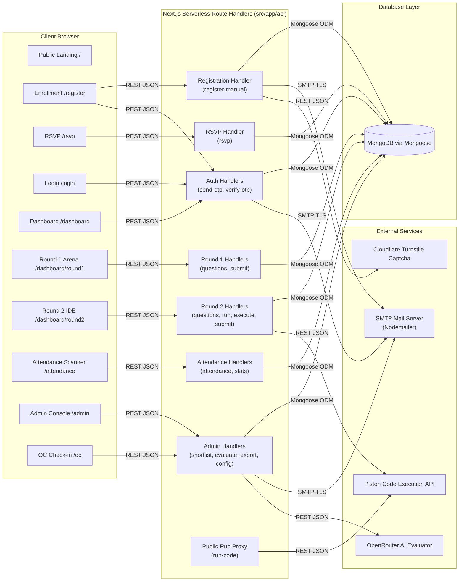
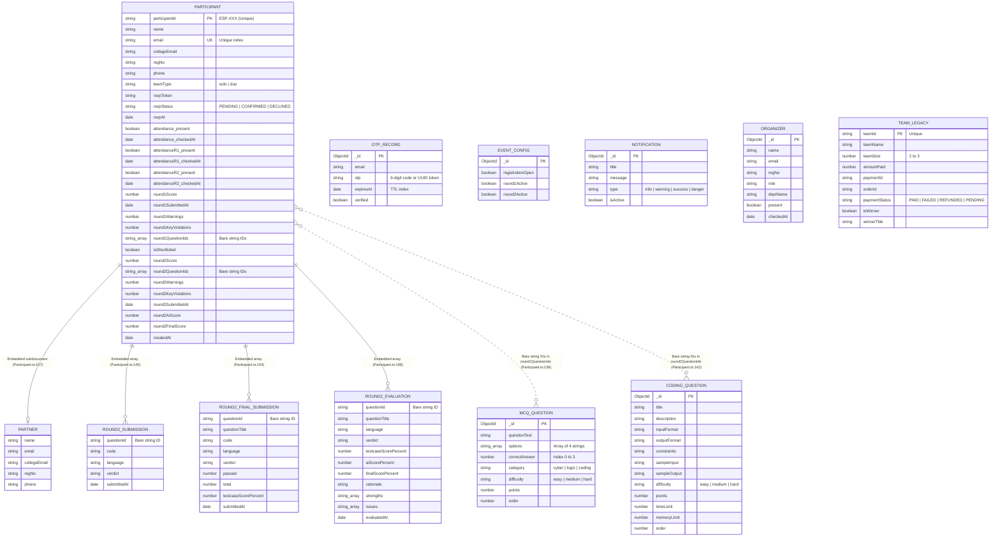
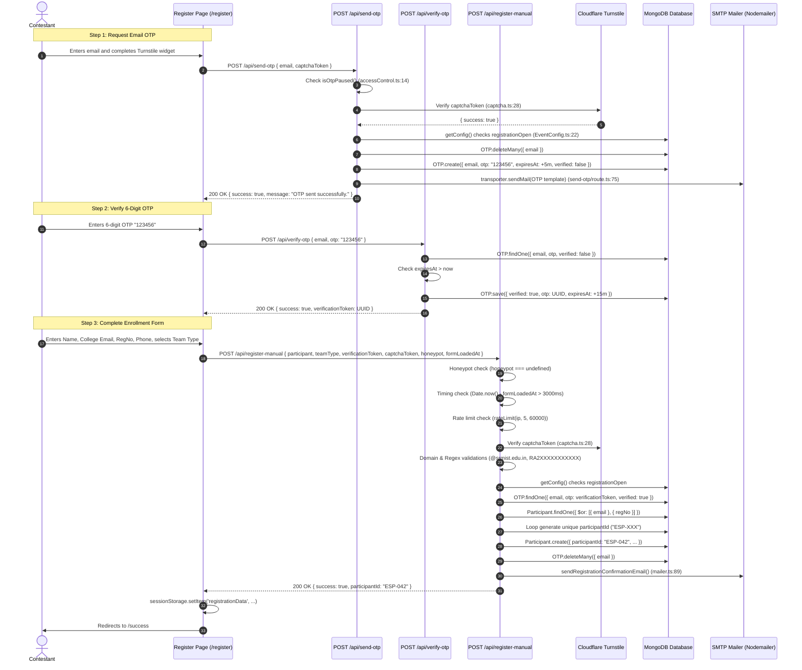

# Espionage Event Platform: Reverse-Engineering & Technical Specification Report

> **Target Repository:** `espionage-event`  
> **Repository Remote:** `https://github.com/dBug-Labs/espionage-event` ([.git/config:9](file:///Users/ipick/Desktop/hackback/espionage-event/.git/config#L9))  
> **Analysis Scope:** Architecture, Dependencies, Runtime Config, Routing Surface, Data Models, Sequence Traces, Security Posture, and UI Journeys.  
> **Inspection Mode:** Strictly read-only analysis without modifications to repository code.

---

## 1. Tech Stack & Dependencies

All versions are extracted directly from the project manifest [package.json](file:///Users/ipick/Desktop/hackback/espionage-event/package.json) (declared specifier) and the resolved lockfile [package-lock.json](file:///Users/ipick/Desktop/hackback/espionage-event/package-lock.json) (locked version).

| Category | Technology | Declared Version ([package.json](file:///Users/ipick/Desktop/hackback/espionage-event/package.json)) | Locked Version ([package-lock.json](file:///Users/ipick/Desktop/hackback/espionage-event/package-lock.json)) | Purpose in Codebase |
|---|---|---|---|---|
| **Language** | TypeScript | `^5` ([L37](file:///Users/ipick/Desktop/hackback/espionage-event/package.json#L37)) | `5.9.3` ([L6448](file:///Users/ipick/Desktop/hackback/espionage-event/package-lock.json#L6448)) | Primary statically typed language for frontend pages, route handlers, and shared models |
| **Framework** | Next.js (App Router) | `^16.2.1` ([L22](file:///Users/ipick/Desktop/hackback/espionage-event/package.json#L22)) | `16.2.1` ([L4942](file:///Users/ipick/Desktop/hackback/espionage-event/package-lock.json#L4942)) | Unified full-stack web application framework and serverless HTTP runtime |
| **UI Library** | React | `19.0.0` ([L26](file:///Users/ipick/Desktop/hackback/espionage-event/package.json#L26)) | `19.0.0` ([L5455](file:///Users/ipick/Desktop/hackback/espionage-event/package-lock.json#L5455)) | Client component rendering and interactive page state |
| **UI Library** | React DOM | `19.0.0` ([L27](file:///Users/ipick/Desktop/hackback/espionage-event/package.json#L27)) | `19.0.0` ([L5464](file:///Users/ipick/Desktop/hackback/espionage-event/package-lock.json#L5464)) | DOM renderer for React 19 |
| **Database ODM**| Mongoose | `^9.2.4` ([L21](file:///Users/ipick/Desktop/hackback/espionage-event/package.json#L21)) | `9.3.0` ([L4857](file:///Users/ipick/Desktop/hackback/espionage-event/package-lock.json#L4857)) | MongoDB object-document mapper and schema enforcement |
| **Database Driver** | MongoDB Driver (transitive) | `~7.1` ([L4862](file:///Users/ipick/Desktop/hackback/espionage-event/package-lock.json#L4862)) | `7.1.0` ([L4798](file:///Users/ipick/Desktop/hackback/espionage-event/package-lock.json#L4798)) | Underlying MongoDB wire protocol client |
| **Styling** | Tailwind CSS | `^4` ([L28](file:///Users/ipick/Desktop/hackback/espionage-event/package.json#L28)) | `4.2.1` ([L6220](file:///Users/ipick/Desktop/hackback/espionage-event/package-lock.json#L6220)) | Utility styling engine |
| **Styling** | @tailwindcss/postcss | `^4` ([L14](file:///Users/ipick/Desktop/hackback/espionage-event/package.json#L14)) | `4.2.1` ([L841](file:///Users/ipick/Desktop/hackback/espionage-event/package-lock.json#L841)) | PostCSS compiler bridge for Tailwind CSS v4 ([postcss.config.mjs:1-6](file:///Users/ipick/Desktop/hackback/espionage-event/postcss.config.mjs#L1-L6)) |
| **Code Editor** | Monaco Editor | `^0.55.1` ([L20](file:///Users/ipick/Desktop/hackback/espionage-event/package.json#L20)) | `0.55.1` ([L4788](file:///Users/ipick/Desktop/hackback/espionage-event/package-lock.json#L4788)) | Browser-based IDE core for the Round 2 coding arena |
| **Code Editor** | @monaco-editor/react | `^4.7.0` ([L13](file:///Users/ipick/Desktop/hackback/espionage-event/package.json#L13)) | `4.7.0` ([L798](file:///Users/ipick/Desktop/hackback/espionage-event/package-lock.json#L798)) | React wrapper component for Monaco Editor |
| **Email** | Nodemailer | `^8.0.2` ([L23](file:///Users/ipick/Desktop/hackback/espionage-event/package.json#L23)) | `8.0.2` ([L5043](file:///Users/ipick/Desktop/hackback/espionage-event/package-lock.json#L5043)) | Outbound SMTP email delivery for OTPs, RSVPs, QR passes, and shortlists |
| **QR Generation**| qrcode | `^1.5.4` ([L25](file:///Users/ipick/Desktop/hackback/espionage-event/package.json#L25)) | `1.5.4` ([L5418](file:///Users/ipick/Desktop/hackback/espionage-event/package-lock.json#L5418)) | Generates Data URL QR images embedded into participant entry passes |
| **QR Scanning** | html5-qrcode | `^2.3.8` ([L18](file:///Users/ipick/Desktop/hackback/espionage-event/package.json#L18)) | `2.3.8` ([L3754](file:///Users/ipick/Desktop/hackback/espionage-event/package-lock.json#L3754)) | Camera-based QR ticket scanner for the on-site check-in desk |
| **PDF Tools** | pdf-lib | `^1.17.1` ([L24](file:///Users/ipick/Desktop/hackback/espionage-event/package.json#L24)) | `1.17.1` ([L5297](file:///Users/ipick/Desktop/hackback/espionage-event/package-lock.json#L5297)) | Modifies PDF templates for generating participation certificates |
| **Archiving** | jszip | `^3.10.1` ([L19](file:///Users/ipick/Desktop/hackback/espionage-event/package.json#L19)) | `3.10.1` ([L4345](file:///Users/ipick/Desktop/hackback/espionage-event/package-lock.json#L4345)) | In-memory ZIP packaging for batch certificate downloads |
| **Security** | dompurify | `^3.3.3` ([L16,40](file:///Users/ipick/Desktop/hackback/espionage-event/package.json#L16)) | `3.3.3` ([L2668](file:///Users/ipick/Desktop/hackback/espionage-event/package-lock.json#L2668)) | DOM XSS sanitization (also locked via npm overrides) |
| **Env Loader** | dotenv | `^17.3.1` ([L17](file:///Users/ipick/Desktop/hackback/espionage-event/package.json#L17)) | `17.3.1` ([L2678](file:///Users/ipick/Desktop/hackback/espionage-event/package-lock.json#L2678)) | Environment configuration reader used in standalone emergency scripts |
| **Linter** | ESLint | `^9` ([L35](file:///Users/ipick/Desktop/hackback/espionage-event/package.json#L35)) | `9.39.4` ([L2916](file:///Users/ipick/Desktop/hackback/espionage-event/package-lock.json#L2916)) | Code quality linter |
| **Linter Config**| eslint-config-next | `15.1.0` ([L36](file:///Users/ipick/Desktop/hackback/espionage-event/package.json#L36)) | `15.1.0` ([L2976](file:///Users/ipick/Desktop/hackback/espionage-event/package-lock.json#L2976)) | Next.js standard ESLint rule configuration |

---

## 2. How to Run It Locally

### Execution Commands
All commands are taken directly from [package.json:5-11](file:///Users/ipick/Desktop/hackback/espionage-event/package.json#L5-L11) and [README.md:88-91](file:///Users/ipick/Desktop/hackback/espionage-event/README.md#L88-L91):

1. **Install dependencies:** `npm install` ([README.md:88](file:///Users/ipick/Desktop/hackback/espionage-event/README.md#L88))
2. **Configure environment:** `cp .env.example .env.local` ([README.md:89](file:///Users/ipick/Desktop/hackback/espionage-event/README.md#L89))
3. **Start development server:** `npm run dev` (executes `next dev` per [package.json:6](file:///Users/ipick/Desktop/hackback/espionage-event/package.json#L6); runs at `http://localhost:3000` per [README.md:90](file:///Users/ipick/Desktop/hackback/espionage-event/README.md#L90))
4. **Compile production build:** `npm run build` (executes `next build` per [package.json:7](file:///Users/ipick/Desktop/hackback/espionage-event/package.json#L7))
5. **Run production server:** `npm start` (executes `next start` per [package.json:8](file:///Users/ipick/Desktop/hackback/espionage-event/package.json#L8))
6. **Run linter:** `npm run lint` (executes `eslint` per [package.json:9](file:///Users/ipick/Desktop/hackback/espionage-event/package.json#L9))
7. **Run unit tests:** `npm test` (executes `node --experimental-strip-types src/lib/piston.test.ts` per [package.json:10](file:///Users/ipick/Desktop/hackback/espionage-event/package.json#L10))

### Environment Variables
*(Names only, never values, gathered from [.env.example:1-40](file:///Users/ipick/Desktop/hackback/espionage-event/.env.example#L1-L40) and code references).*

| Variable Name | Requirement Status | Purpose & Evidence |
|---|---|---|
| `MONGODB_URI` | **Mandatory** | MongoDB connection string. Server throws an explicit error if missing ([mongodb.ts:24-26](file:///Users/ipick/Desktop/hackback/espionage-event/src/lib/mongodb.ts#L24-L26)). Also read in [certificates/route.ts:20](file:///Users/ipick/Desktop/hackback/espionage-event/src/app/api/admin/certificates/route.ts#L20) and [winner/route.ts:18](file:///Users/ipick/Desktop/hackback/espionage-event/src/app/api/admin/teams/%5Bid%5D/winner/route.ts#L18). |
| `ADMIN_PASSWORD` | **Mandatory** | Master password guarding admin endpoints and attendance desk access ([admin/verify/route.ts:6](file:///Users/ipick/Desktop/hackback/espionage-event/src/app/api/admin/verify/route.ts#L6), [attendance/stats/route.ts:14](file:///Users/ipick/Desktop/hackback/espionage-event/src/app/api/attendance/stats/route.ts#L14)). |
| `SMTP_HOST` | Mandatory for email | SMTP server hostname ([mailer.ts:5](file:///Users/ipick/Desktop/hackback/espionage-event/src/lib/mailer.ts#L5), [send-otp/route.ts:10](file:///Users/ipick/Desktop/hackback/espionage-event/src/app/api/send-otp/route.ts#L10), [auth/send-otp/route.ts:9](file:///Users/ipick/Desktop/hackback/espionage-event/src/app/api/auth/send-otp/route.ts#L9)). |
| `SMTP_PORT` | Optional (default: `587`) | SMTP port number ([mailer.ts:6](file:///Users/ipick/Desktop/hackback/espionage-event/src/lib/mailer.ts#L6), [send-otp/route.ts:11](file:///Users/ipick/Desktop/hackback/espionage-event/src/app/api/send-otp/route.ts#L11)). |
| `SMTP_USER` | Mandatory for email | SMTP username and sender email address ([mailer.ts:9,91](file:///Users/ipick/Desktop/hackback/espionage-event/src/lib/mailer.ts#L9), [send-otp/route.ts:14,76](file:///Users/ipick/Desktop/hackback/espionage-event/src/app/api/send-otp/route.ts#L14)). |
| `SMTP_PASS` | Mandatory for email | SMTP authentication password ([mailer.ts:10](file:///Users/ipick/Desktop/hackback/espionage-event/src/lib/mailer.ts#L10), [send-otp/route.ts:15](file:///Users/ipick/Desktop/hackback/espionage-event/src/app/api/send-otp/route.ts#L15)). |
| `PISTON_API_URL` | Optional (default: public EMKC) | Base URL of the Piston code execution runner ([piston.ts:1,82](file:///Users/ipick/Desktop/hackback/espionage-event/src/lib/piston.ts#L1)). |
| `PISTON_API_KEY` | Mandatory for Round 2 code execution | API key for the Piston service. Throws `PistonServiceError` if unset ([piston.ts:86-89](file:///Users/ipick/Desktop/hackback/espionage-event/src/lib/piston.ts#L86-L89)). |
| `OPENROUTER_API_KEY` | Mandatory for AI grading | API key for OpenRouter LLM completions ([openrouter.ts:2-3](file:///Users/ipick/Desktop/hackback/espionage-event/src/lib/openrouter.ts#L2-L3)). |
| `OPENROUTER_MODEL` | Optional (default: `'openrouter/free'`) | LLM model identifier for code evaluation ([openrouter.ts:4](file:///Users/ipick/Desktop/hackback/espionage-event/src/lib/openrouter.ts#L4)). |
| `TURNSTILE_SECRET_KEY` | Optional in dev | Cloudflare Turnstile secret key. If empty, captcha validation is bypassed ([captcha.ts:14-17](file:///Users/ipick/Desktop/hackback/espionage-event/src/lib/captcha.ts#L14-L17)). |
| `NEXT_PUBLIC_TURNSTILE_SITE_KEY` | Optional | Client-side site key for Turnstile widget ([register/page.tsx:16](file:///Users/ipick/Desktop/hackback/espionage-event/src/app/register/page.tsx#L16)). |
| `EVENT_DATE` | Optional | Human-readable event date for email templates ([mailer.ts:54,113,183](file:///Users/ipick/Desktop/hackback/espionage-event/src/lib/mailer.ts#L54), [auth/send-otp/route.ts:48](file:///Users/ipick/Desktop/hackback/espionage-event/src/app/api/auth/send-otp/route.ts#L48)). |
| `EVENT_TIME` | Optional | Human-readable event time for email templates ([mailer.ts:55,114,184](file:///Users/ipick/Desktop/hackback/espionage-event/src/lib/mailer.ts#L55), [auth/send-otp/route.ts:49](file:///Users/ipick/Desktop/hackback/espionage-event/src/app/api/auth/send-otp/route.ts#L49)). |
| `EVENT_VENUE` | Optional | Human-readable event venue for email templates ([mailer.ts:56,115,185](file:///Users/ipick/Desktop/hackback/espionage-event/src/lib/mailer.ts#L56), [auth/send-otp/route.ts:50](file:///Users/ipick/Desktop/hackback/espionage-event/src/app/api/auth/send-otp/route.ts#L50)). |
| `NEXT_PUBLIC_EVENT_DATE` | Optional | Display date for landing and success pages ([page.tsx:110](file:///Users/ipick/Desktop/hackback/espionage-event/src/app/page.tsx#L110), [success/page.tsx:175](file:///Users/ipick/Desktop/hackback/espionage-event/src/app/success/page.tsx#L175)). |
| `NEXT_PUBLIC_EVENT_TIME` | Optional | Display time for landing and success pages ([page.tsx:114](file:///Users/ipick/Desktop/hackback/espionage-event/src/app/page.tsx#L114), [success/page.tsx:182](file:///Users/ipick/Desktop/hackback/espionage-event/src/app/success/page.tsx#L182)). |
| `NEXT_PUBLIC_EVENT_VENUE` | Optional | Display venue for landing and success pages ([page.tsx:118](file:///Users/ipick/Desktop/hackback/espionage-event/src/app/page.tsx#L118), [success/page.tsx:189](file:///Users/ipick/Desktop/hackback/espionage-event/src/app/success/page.tsx#L189)). |
| `NEXT_PUBLIC_SITE_URL` | Optional (default: `http://localhost:3000`) | Base public URL used in email links and OpenRouter referrer header ([mailer.ts:111,180](file:///Users/ipick/Desktop/hackback/espionage-event/src/lib/mailer.ts#L111), [openrouter.ts:11](file:///Users/ipick/Desktop/hackback/espionage-event/src/lib/openrouter.ts#L11)). |
| `NEXT_PUBLIC_WHATSAPP_LINK` | Optional (default: `'#'`) | Community invite link in emails and registration success screen ([mailer.ts:26](file:///Users/ipick/Desktop/hackback/espionage-event/src/lib/mailer.ts#L26), [success/page.tsx:18](file:///Users/ipick/Desktop/hackback/espionage-event/src/app/success/page.tsx#L18)). |
| `LOGIN_PAUSED` | Optional kill switch | Disables login endpoints when set to `'true'` or `'1'` ([accessControl.ts:10](file:///Users/ipick/Desktop/hackback/espionage-event/src/lib/accessControl.ts#L10)). |
| `NEXT_PUBLIC_LOGIN_PAUSED` | Optional kill switch | Disables login UI when set to `'true'` or `'1'` ([accessControl.ts:10](file:///Users/ipick/Desktop/hackback/espionage-event/src/lib/accessControl.ts#L10), [login/page.tsx:10-11](file:///Users/ipick/Desktop/hackback/espionage-event/src/app/login/page.tsx#L10-L11)). |
| `OTP_ROUTES_PAUSED` | Optional kill switch | Disables OTP sending endpoints when set to `'true'` or `'1'` ([accessControl.ts:14](file:///Users/ipick/Desktop/hackback/espionage-event/src/lib/accessControl.ts#L14)). |
| `NEXT_PUBLIC_OTP_ROUTES_PAUSED` | Optional kill switch | Disables OTP requests in UI when set to `'true'` or `'1'` ([accessControl.ts:14](file:///Users/ipick/Desktop/hackback/espionage-event/src/lib/accessControl.ts#L14), [login/page.tsx:12-13](file:///Users/ipick/Desktop/hackback/espionage-event/src/app/login/page.tsx#L12-L13)). |

---

## 3. Folder Map & Key Files

### Top-Level Folders
- `public/`: Static web assets, including certificate PDF templates, QR codes, icons, and hero background images ([public/](file:///Users/ipick/Desktop/hackback/espionage-event/public)).
- `src/`: Core TypeScript source tree containing application pages, serverless API routes, utility libraries, and Mongoose database models ([src/](file:///Users/ipick/Desktop/hackback/espionage-event/src)).
- `stitch_screens/`: Standalone unrouted HTML prototypes exported from an external visual design tool named "Stitch" ([stitch_screens/](file:///Users/ipick/Desktop/hackback/espionage-event/stitch_screens)).

### 10 Most Important Files
1. [src/lib/mongodb.ts](file:///Users/ipick/Desktop/hackback/espionage-event/src/lib/mongodb.ts#L1-L39) — Connects to MongoDB via Mongoose and maintains a global cached promise to prevent socket exhaustion during serverless invocations.
2. [src/models/Participant.ts](file:///Users/ipick/Desktop/hackback/espionage-event/src/models/Participant.ts#L1-L195) — Defines the core data schema storing participant identities, duo partners, RSVP confirmations, attendance status, and test submissions.
3. [src/models/EventConfig.ts](file:///Users/ipick/Desktop/hackback/espionage-event/src/models/EventConfig.ts#L1-L34) — Singleton Mongoose schema maintaining real-time global toggles for registration, Round 1, and Round 2 availability.
4. [src/app/api/register-manual/route.ts](file:///Users/ipick/Desktop/hackback/espionage-event/src/app/api/register-manual/route.ts#L36-L293) — Main candidate enrollment endpoint implementing 7 defensive validation layers, honeypots, timing checks, and unique ID generation.
5. [src/app/api/auth/verify-otp/route.ts](file:///Users/ipick/Desktop/hackback/espionage-event/src/app/api/auth/verify-otp/route.ts#L8-L66) — Validates candidate login 6-digit email OTPs against the database and returns contestant dashboard sessions.
6. [src/app/api/round1/submit/route.ts](file:///Users/ipick/Desktop/hackback/espionage-event/src/app/api/round1/submit/route.ts#L7-L64) — Evaluates Round 1 MCQ submissions against answer keys and records contestant scores and anti-cheat violations.
7. [src/app/api/round2/execute/route.ts](file:///Users/ipick/Desktop/hackback/espionage-event/src/app/api/round2/execute/route.ts#L16-L174) — Evaluates Round 2 source code against hidden test cases sequentially through the Piston sandbox runner.
8. [src/lib/piston.ts](file:///Users/ipick/Desktop/hackback/espionage-event/src/lib/piston.ts#L1-L385) — Resilient HTTP client wrapper for Piston API v2 with automatic retries, exponential backoff, and runtime version caching.
9. [src/lib/round2Evaluation.ts](file:///Users/ipick/Desktop/hackback/espionage-event/src/lib/round2Evaluation.ts#L1-L126) — Formulates structured code evaluation prompts and grades partial solutions using OpenRouter LLM completions.
10. [src/app/api/admin/verify/route.ts](file:///Users/ipick/Desktop/hackback/espionage-event/src/app/api/admin/verify/route.ts#L3-L13) — Authenticates administrative and desk scanner credentials against `ADMIN_PASSWORD`.

---

## 4. Odd Files & Extraneous Code

| File Path | Description & Proof of Anomaly | Reason It Looks Odd / Does Not Belong |
|---|---|---|
| [save_and_clean.js](file:///Users/ipick/Desktop/hackback/espionage-event/save_and_clean.js#L1-L59) | Emergency script labeled `"EMERGENCY SCRIPT: Save first 5 registrations, delete all spam"` ([L1-4](file:///Users/ipick/Desktop/hackback/espionage-event/save_and_clean.js#L1-L4)). Connects directly to MongoDB, saves the first 5 records to a local file `backup_first_5.json` ([L32](file:///Users/ipick/Desktop/hackback/espionage-event/save_and_clean.js#L32)), and runs `collection.deleteMany({})` ([L37](file:///Users/ipick/Desktop/hackback/espionage-event/save_and_clean.js#L37)). | One-off incident remediation script left in the repository root. Not referenced by `package.json` or build scripts. High destructive risk if accidentally executed. |
| [test-rp.js](file:///Users/ipick/Desktop/hackback/espionage-event/test-rp.js#L1-L39) | Automated browser test script that imports `playwright` ([L1](file:///Users/ipick/Desktop/hackback/espionage-event/test-rp.js#L1)), visits `/register`, inputs dummy values, clicks `"Proceed to Payment"` ([L30](file:///Users/ipick/Desktop/hackback/espionage-event/test-rp.js#L30)), and checks `window.Razorpay` ([L34](file:///Users/ipick/Desktop/hackback/espionage-event/test-rp.js#L34)). | Stale test script. `playwright` is not declared in `package.json` (running it fails immediately). Razorpay payment gateways are completely absent from the free Espionage event model. |
| [export_q_bank.ts](file:///Users/ipick/Desktop/hackback/espionage-event/export_q_bank.ts#L1-L12) | Standalone TypeScript script that imports `ROUND1_MCQ_BANK` and `ROUND2_CODING_BANK` and writes them to local disk as `final_mcqs.json` and `final_coding.json` ([L10-11](file:///Users/ipick/Desktop/hackback/espionage-event/export_q_bank.ts#L10-L11)). | One-off data extraction script left in the project root; not referenced in `package.json` or application logic. |
| `stitch_screens/` ([dashboard.html](file:///Users/ipick/Desktop/hackback/espionage-event/stitch_screens/dashboard.html), [enrollment.html](file:///Users/ipick/Desktop/hackback/espionage-event/stitch_screens/enrollment.html), [landing.html](file:///Users/ipick/Desktop/hackback/espionage-event/stitch_screens/landing.html)) | Raw static HTML files importing Tailwind CSS and Google Fonts via external CDN script tags ([landing.html:7-10](file:///Users/ipick/Desktop/hackback/espionage-event/stitch_screens/landing.html#L7-L10)). | Static mockup exports from a design tool named "Stitch". They are completely unrouted, duplicated by the React components in `src/app/`, and serve no runtime purpose. |
| [src/app/run-code/route.ts](file:///Users/ipick/Desktop/hackback/espionage-event/src/app/run-code/route.ts#L1-L42) | Route handler exposing `POST /run-code` that accepts `{ source_code, language, version }` and dispatches it directly to Piston ([L6-12](file:///Users/ipick/Desktop/hackback/espionage-event/src/app/run-code/route.ts#L6-L12)). | Completely unauthenticated, publicly accessible proxy to the Piston code runner. The contest UI exclusively uses `/api/round2/run` and `/api/round2/execute`. `/run-code` is not invoked anywhere in the codebase. |
| [src/models/Team.ts](file:///Users/ipick/Desktop/hackback/espionage-event/src/models/Team.ts#L1-L70) & [src/app/api/admin/certificates/route.ts](file:///Users/ipick/Desktop/hackback/espionage-event/src/app/api/admin/certificates/route.ts#L1-L60) | Mongoose model tracking paid multi-member teams with Razorpay fields (`amountPaid`, `paymentId`, `orderId`) ([Team.ts:17-20](file:///Users/ipick/Desktop/hackback/espionage-event/src/models/Team.ts#L17-L20)), queried by a certificate generator hardcoded for `"Housie of Fame"` ([certificates/route.ts:45](file:///Users/ipick/Desktop/hackback/espionage-event/src/app/api/admin/certificates/route.ts#L45)). | Dead code leftover from a previous event ("Housie of Fame"). The Espionage event uses `Participant` for all registrations and has no payment or team creation flows. |

---

## 5. Product Explanation (For a First-Year Student)

### 3-Sentence Summary
1. This software platform powers a collegiate two-round technical hackathon and coding contest organized by dBug Labs at SRM IST ([README.md:1-5](file:///Users/ipick/Desktop/hackback/espionage-event/README.md#L1-L5), [page.tsx:358-364](file:///Users/ipick/Desktop/hackback/espionage-event/src/app/page.tsx#L358-L364)).
2. It is built for college students who compete individually or in pairs, volunteers who manage on-site attendance, and event administrators who control contest stages ([register/page.tsx:55-58](file:///Users/ipick/Desktop/hackback/espionage-event/src/app/register/page.tsx#L55-L58), [attendance/page.tsx:42-53](file:///Users/ipick/Desktop/hackback/espionage-event/src/app/attendance/page.tsx#L42-L53), [admin/page.tsx:112-140](file:///Users/ipick/Desktop/hackback/espionage-event/src/app/admin/page.tsx#L112-L140)).
3. Students use it to register, confirm their seats under a 120-person cap, solve timed multiple-choice questions in an anti-cheat browser, and write code in an interactive programming arena evaluated by real test cases and AI partial grading ([rsvp/route.ts:5](file:///Users/ipick/Desktop/hackback/espionage-event/src/app/api/rsvp/route.ts#L5), [testSecurity.ts:22-48](file:///Users/ipick/Desktop/hackback/espionage-event/src/lib/testSecurity.ts#L22-L48), [piston.ts:326-384](file:///Users/ipick/Desktop/hackback/espionage-event/src/lib/piston.ts#L326-L384), [round2Evaluation.ts:39-115](file:///Users/ipick/Desktop/hackback/espionage-event/src/lib/round2Evaluation.ts#L39-L115)).

### User Roles & Capabilities

1. **Unregistered Visitor / Applicant:**
   - Can read event rules, round timelines, and eligibility criteria ([page.tsx:8-367](file:///Users/ipick/Desktop/hackback/espionage-event/src/app/page.tsx#L8-L367)).
   - Can request email OTP verification, pass Turnstile captcha, and register solo or with a partner ([register/page.tsx:30-701](file:///Users/ipick/Desktop/hackback/espionage-event/src/app/register/page.tsx#L30-L701), [register-manual/route.ts:36-285](file:///Users/ipick/Desktop/hackback/espionage-event/src/app/api/register-manual/route.ts#L36-L285)).
   - Can confirm seat reservation via unique token links up to the 120-member cap ([rsvp/page.tsx:20-245](file:///Users/ipick/Desktop/hackback/espionage-event/src/app/rsvp/page.tsx#L20-L245), [rsvp/route.ts:36-141](file:///Users/ipick/Desktop/hackback/espionage-event/src/app/api/rsvp/route.ts#L36-L141)).

2. **Registered & Confirmed Contestant:**
   - Logs in with a 6-digit email OTP after RSVP confirmation ([login/page.tsx:8-217](file:///Users/ipick/Desktop/hackback/espionage-event/src/app/login/page.tsx#L8-L217), [auth/send-otp/route.ts:34-44](file:///Users/ipick/Desktop/hackback/espionage-event/src/app/api/auth/send-otp/route.ts#L34-L44)).
   - Views registration ID, round status, and live admin announcements ([dashboard/page.tsx:33-342](file:///Users/ipick/Desktop/hackback/espionage-event/src/app/dashboard/page.tsx#L33-L342)).
   - Takes Round 1 timed MCQ assessment under fullscreen anti-cheat lockdown ([round1/page.tsx:20-614](file:///Users/ipick/Desktop/hackback/espionage-event/src/app/dashboard/round1/page.tsx#L20-L614)).
   - If shortlisted, enters Round 2 Monaco code editor, runs test code against sample cases, and submits against hidden test cases ([round2/page.tsx:48-969](file:///Users/ipick/Desktop/hackback/espionage-event/src/app/dashboard/round2/page.tsx#L48-L969)).

3. **Attendance Volunteer / Organizing Committee (OC):**
   - Unlocks the desk scanner using `ADMIN_PASSWORD` ([attendance/page.tsx:78](file:///Users/ipick/Desktop/hackback/espionage-event/src/app/attendance/page.tsx#L78)).
   - Scans participant QR codes or enters `ESP-XXX` codes to record presence for Round 1 and Round 2 ([attendance/page.tsx:169-320](file:///Users/ipick/Desktop/hackback/espionage-event/src/app/attendance/page.tsx#L169-L320), [attendance/route.ts:70-185](file:///Users/ipick/Desktop/hackback/espionage-event/src/app/api/attendance/route.ts#L70-L185)).
   - Logs committee volunteer presence via `/oc` ([oc/page.tsx:7-203](file:///Users/ipick/Desktop/hackback/espionage-event/src/app/oc/page.tsx#L7-L203)).

4. **Event Administrator:**
   - Authenticates to `/admin` using `ADMIN_PASSWORD` ([admin/verify/route.ts:6](file:///Users/ipick/Desktop/hackback/espionage-event/src/app/api/admin/verify/route.ts#L6)).
   - Toggles global switches for registration, Round 1 active, and Round 2 active ([admin/event-config/route.ts:17-36](file:///Users/ipick/Desktop/hackback/espionage-event/src/app/api/admin/event-config/route.ts#L17-L36)).
   - Sends RSVP invitation emails and attendance QR entry passes ([admin/send-rsvp/route.ts:17-101](file:///Users/ipick/Desktop/hackback/espionage-event/src/app/api/admin/send-rsvp/route.ts#L17-L101), [admin/send-attendance-qr/route.ts:6-60](file:///Users/ipick/Desktop/hackback/espionage-event/src/app/api/admin/send-attendance-qr/route.ts#L6-L60)).
   - Shortlists top candidates by Round 1 score and triggers notification emails ([admin/shortlist/route.ts:6-62](file:///Users/ipick/Desktop/hackback/espionage-event/src/app/api/admin/shortlist/route.ts#L6-L62)).
   - Runs OpenRouter AI evaluation for partial credit grading ([admin/round2-evaluate/route.ts:7-122](file:///Users/ipick/Desktop/hackback/espionage-event/src/app/api/admin/round2-evaluate/route.ts#L7-L122)).
   - Manages question banks, resets candidate round attempts, posts alerts, and exports participant records to CSV ([admin/page.tsx:112-1329](file:///Users/ipick/Desktop/hackback/espionage-event/src/app/admin/page.tsx#L112-L1329), [admin/export/route.ts:11-66](file:///Users/ipick/Desktop/hackback/espionage-event/src/app/api/admin/export/route.ts#L11-L66)).

### 3–5 Core Features & Implementing Code
1. **Enrollment with Multi-Layered Spam & Bot Protection:** Enforces Cloudflare Turnstile, OTP verification, honeypot fields, minimum submission elapsed duration, SRMIST email domain verification, and unique `ESP-XXX` ID allocation ([src/app/register/page.tsx](file:///Users/ipick/Desktop/hackback/espionage-event/src/app/register/page.tsx), [src/app/api/register-manual/route.ts](file:///Users/ipick/Desktop/hackback/espionage-event/src/app/api/register-manual/route.ts)).
2. **Proctored Round 1 MCQ Testing:** Browser lockdown enforcing fullscreen mode and keyboard lock; deterministically assigns 25 questions seeded by email, and auto-submits on violation limits ([src/lib/testSecurity.ts](file:///Users/ipick/Desktop/hackback/espionage-event/src/lib/testSecurity.ts), [src/app/dashboard/round1/page.tsx](file:///Users/ipick/Desktop/hackback/espionage-event/src/app/dashboard/round1/page.tsx), [src/app/api/round1/submit/route.ts](file:///Users/ipick/Desktop/hackback/espionage-event/src/app/api/round1/submit/route.ts)).
3. **Round 2 Sandboxed Code Execution:** Monaco Editor interface communicating with an external Piston service to run code across C, C++, Java, and Python with test case throttling and evaluation ([src/lib/piston.ts](file:///Users/ipick/Desktop/hackback/espionage-event/src/lib/piston.ts), [src/app/dashboard/round2/page.tsx](file:///Users/ipick/Desktop/hackback/espionage-event/src/app/dashboard/round2/page.tsx), [src/app/api/round2/execute/route.ts](file:///Users/ipick/Desktop/hackback/espionage-event/src/app/api/round2/execute/route.ts)).
4. **AI-Assisted Partial Credit Grading:** Inspects non-passing code submissions and sends structured prompts to OpenRouter LLMs to compute weighted partial scores and qualitative feedback ([src/lib/round2Evaluation.ts](file:///Users/ipick/Desktop/hackback/espionage-event/src/lib/round2Evaluation.ts), [src/lib/openrouter.ts](file:///Users/ipick/Desktop/hackback/espionage-event/src/lib/openrouter.ts), [src/app/api/admin/round2-evaluate/route.ts](file:///Users/ipick/Desktop/hackback/espionage-event/src/app/api/admin/round2-evaluate/route.ts)).
5. **On-Site QR Attendance Check-In:** Camera-enabled QR scanner and verification console verifying registration eligibility and recording Round 1 and Round 2 presence ([src/app/attendance/page.tsx](file:///Users/ipick/Desktop/hackback/espionage-event/src/app/attendance/page.tsx), [src/app/api/attendance/route.ts](file:///Users/ipick/Desktop/hackback/espionage-event/src/app/api/attendance/route.ts)).

### Documentation Drift (README Claims Missing in Code)
1. **Certificate Generation for Contestants:** [README.md:25](file:///Users/ipick/Desktop/hackback/espionage-event/README.md#L25) asserts: `"Results: winners are marked and certificates are generated as PDFs."` In reality, the certificate route ([certificates/route.ts:45](file:///Users/ipick/Desktop/hackback/espionage-event/src/app/api/admin/certificates/route.ts#L45)) hardcodes `"Housie of Fame"` and queries the obsolete `Team` collection. No certificate generation logic exists for the `Participant` model, and no certificate buttons exist in the admin console ([admin/page.tsx](file:///Users/ipick/Desktop/hackback/espionage-event/src/app/admin/page.tsx)).
2. **JWT-Based Authentication:** [README.md:40,62](file:///Users/ipick/Desktop/hackback/espionage-event/README.md#L40) and earlier documentation claim sessions use JSON Web Tokens (`jsonwebtoken`). In reality, no JWT dependency exists ([package.json:12-29](file:///Users/ipick/Desktop/hackback/espionage-event/package.json#L12-L29)). The server generates an unverified random hex string ([auth/verify-otp/route.ts:50](file:///Users/ipick/Desktop/hackback/espionage-event/src/app/api/auth/verify-otp/route.ts#L50)) and client pages rely solely on unverified browser `localStorage` ([auth.ts:25](file:///Users/ipick/Desktop/hackback/espionage-event/src/lib/auth.ts#L25)).
3. **Winner Marking in Admin UI:** [README.md:25](file:///Users/ipick/Desktop/hackback/espionage-event/README.md#L25) states winners are marked in the system. While `src/app/api/admin/teams/[id]/winner/route.ts` exists for the legacy `Team` collection, the actual admin dashboard ([admin/page.tsx](file:///Users/ipick/Desktop/hackback/espionage-event/src/app/admin/page.tsx)) has no winner-marking buttons or inputs for participants.

---

## 6. System Architecture

### Architecture Component Verification Table

| Box Name | What It Is | Proving File(s) (Path:Line) |
|---|---|---|
| **Client Browser** | Next.js client-side React UI rendering views, managing Monaco editor, camera scanning, and exam proctoring | [layout.tsx:1-31](file:///Users/ipick/Desktop/hackback/espionage-event/src/app/layout.tsx#L1-L31), [page.tsx:8](file:///Users/ipick/Desktop/hackback/espionage-event/src/app/page.tsx#L8), [register/page.tsx:30](file:///Users/ipick/Desktop/hackback/espionage-event/src/app/register/page.tsx#L30), [round2/page.tsx:48](file:///Users/ipick/Desktop/hackback/espionage-event/src/app/dashboard/round2/page.tsx#L48) |
| **Backend API** | Next.js App Router serverless HTTP route handlers processing auth, tests, grading, and admin operations | [register-manual/route.ts:36](file:///Users/ipick/Desktop/hackback/espionage-event/src/app/api/register-manual/route.ts#L36), [round1/submit/route.ts:7](file:///Users/ipick/Desktop/hackback/espionage-event/src/app/api/round1/submit/route.ts#L7), [round2/execute/route.ts:16](file:///Users/ipick/Desktop/hackback/espionage-event/src/app/api/round2/execute/route.ts#L16) |
| **MongoDB** | Primary persistent document database storing contestants, question banks, configurations, and OTPs | [mongodb.ts:1-39](file:///Users/ipick/Desktop/hackback/espionage-event/src/lib/mongodb.ts#L1-L39), [Participant.ts:1-195](file:///Users/ipick/Desktop/hackback/espionage-event/src/models/Participant.ts#L1-L195) |
| **SMTP Mail Server** | Outbound transactional mail delivery for registration confirmations, OTPs, RSVP links, and QR entry passes | [mailer.ts:4-16](file:///Users/ipick/Desktop/hackback/espionage-event/src/lib/mailer.ts#L4-L16), [send-otp/route.ts:75](file:///Users/ipick/Desktop/hackback/espionage-event/src/app/api/send-otp/route.ts#L75) |
| **Piston API** | Sandboxed remote runtime executing student code in C, C++, Java, and Python against sample and hidden test cases | [piston.ts:1-89,326-384](file:///Users/ipick/Desktop/hackback/espionage-event/src/lib/piston.ts#L1-L89), [round2/execute/route.ts:79](file:///Users/ipick/Desktop/hackback/espionage-event/src/app/api/round2/execute/route.ts#L79) |
| **OpenRouter API** | External LLM chat completion API providing heuristic partial-credit grading and reasoning for incomplete coding solutions | [openrouter.ts:1-30](file:///Users/ipick/Desktop/hackback/espionage-event/src/lib/openrouter.ts#L1-L30), [round2Evaluation.ts:39-115](file:///Users/ipick/Desktop/hackback/espionage-event/src/lib/round2Evaluation.ts#L39-L115) |
| **Cloudflare Turnstile** | External bot detection and CAPTCHA verification service validating registration form tokens | [captcha.ts:1-39](file:///Users/ipick/Desktop/hackback/espionage-event/src/lib/captcha.ts#L1-L39), [register-manual/route.ts:77-85](file:///Users/ipick/Desktop/hackback/espionage-event/src/app/api/register-manual/route.ts#L77-L85) |

### Where Does State Live?

1. **Database (MongoDB):**  
   All persistent domain records: `Participant` (identities, scores, submissions, attendance), `EventConfig` (live round toggles), `MCQQuestion` (Round 1 bank), `CodingQuestion` (Round 2 bank and test cases), `OTP` (temporary 5-min codes), `Notification` (broadcast alerts), `Organizer` (committee members), and legacy `Team` records ([Participant.ts:11-88](file:///Users/ipick/Desktop/hackback/espionage-event/src/models/Participant.ts#L11-L88), [EventConfig.ts:4-7](file:///Users/ipick/Desktop/hackback/espionage-event/src/models/EventConfig.ts#L4-L7), [OTP.ts:3-8](file:///Users/ipick/Desktop/hackback/espionage-event/src/models/OTP.ts#L3-L8)).
2. **Browser Storage:**  
   - `localStorage`:
     - Key `'espionage_session'`: Stores contestant session payload `{ participantId, name, email, isShortlisted, token }` ([auth.ts:25](file:///Users/ipick/Desktop/hackback/espionage-event/src/lib/auth.ts#L25), [login/page.tsx:86](file:///Users/ipick/Desktop/hackback/espionage-event/src/app/login/page.tsx#L86)).
     - Key `'adminPassword'`: Stores admin console access token ([admin/page.tsx:117](file:///Users/ipick/Desktop/hackback/espionage-event/src/app/admin/page.tsx#L117)).
     - Key `'attendancePassword'`: Stores volunteer scanner authentication ([attendance/page.tsx:32](file:///Users/ipick/Desktop/hackback/espionage-event/src/app/attendance/page.tsx#L32)).
   - `sessionStorage`:
     - Key `'registrationData'`: Stores new registrant summary forwarded from `/register` to `/success` ([register/page.tsx:334](file:///Users/ipick/Desktop/hackback/espionage-event/src/app/register/page.tsx#L334), [success/page.tsx:21](file:///Users/ipick/Desktop/hackback/espionage-event/src/app/success/page.tsx#L21)).
   - React Component State & Refs: Active MCQ selected choices, Monaco editor code buffers, anti-cheat violation counters, and remaining countdown timers ([round1/page.tsx:82-83](file:///Users/ipick/Desktop/hackback/espionage-event/src/app/dashboard/round1/page.tsx#L82), [round2/page.tsx:78-79](file:///Users/ipick/Desktop/hackback/espionage-event/src/app/dashboard/round2/page.tsx#L78)).
3. **Server Memory (RAM):**  
   - In-memory rate limiting map: `ipCache = new Map<string, { count: number; resetTime: number }>()` ([rate-limit.ts:11](file:///Users/ipick/Desktop/hackback/espionage-event/src/lib/rate-limit.ts#L11)).
   - Cached Mongoose database connection promise: `(global as any).mongoose` ([mongodb.ts:8](file:///Users/ipick/Desktop/hackback/espionage-event/src/lib/mongodb.ts#L8)).
   - Cached Piston runtime language definitions: `cachedRuntimes: PistonRuntime[] | null` ([piston.ts:10](file:///Users/ipick/Desktop/hackback/espionage-event/src/lib/piston.ts#L10)).
   - Hardcoded default question bank templates: `ROUND1_MCQ_BANK` and `ROUND2_CODING_BANK` ([questionBank.ts:25,32](file:///Users/ipick/Desktop/hackback/espionage-event/src/lib/questionBank.ts#L25)).
4. **Files on Disk:**  
   - Static PDF template: `public/certificate_template.pdf` ([certificates/route.ts:38](file:///Users/ipick/Desktop/hackback/espionage-event/src/app/api/admin/certificates/route.ts#L38)).
   - Static images: `public/images/landing-bg.jpg`, `public/images/enrollment-bg.jpg` ([public/images/](file:///Users/ipick/Desktop/hackback/espionage-event/public/images)).
   - Emergency script exports: `save_and_clean.js` generates `./backup_first_5.json` ([save_and_clean.js:32](file:///Users/ipick/Desktop/hackback/espionage-event/save_and_clean.js#L32)) and `export_q_bank.ts` creates `final_mcqs.json` / `final_coding.json` ([export_q_bank.ts:10-11](file:///Users/ipick/Desktop/hackback/espionage-event/export_q_bank.ts#L10-L11)).
5. **Cache:**  
   No external distributed cache (such as Redis) is configured. All caching resides within local server process memory ([piston.ts:10](file:///Users/ipick/Desktop/hackback/espionage-event/src/lib/piston.ts#L10), [rate-limit.ts:11](file:///Users/ipick/Desktop/hackback/espionage-event/src/lib/rate-limit.ts#L11)).

### Not Sure List
- **Production Piston Hosting:** Not sure whether the production deployment utilizes a self-hosted private Piston runner or relies on the public fallback `https://emkc.org/api/v2/piston` ([piston.ts:1](file:///Users/ipick/Desktop/hackback/espionage-event/src/lib/piston.ts#L1)).
- **Email Verification Bypass in Dev:** Not sure whether SMS delivery was ever planned; only Nodemailer SMTP is implemented.

---

## 7. Application Entry Points

### Table 1: API / Backend Route Handlers

Total API route files: **37** | Total route handlers: **46**

| Method | Path | What It Does | Input | Output | Who May Call It | Auth Check (Path:Line) |
|---|---|---|---|---|---|---|
| `POST` | `/api/admin/bulk-seed` | Seeds MCQ or coding questions in bulk | JSON: `{ password, type, questions }` | JSON: `{ message }` | Admin | [bulk-seed/route.ts:10](file:///Users/ipick/Desktop/hackback/espionage-event/src/app/api/admin/bulk-seed/route.ts#L10) |
| `GET` | `/api/admin/certificates` | Generates ZIP of PDFs for eligible teams | Query: `?type=participant\|winner`, Header: `Authorization` | Binary ZIP stream (`application/zip`) | Admin | [certificates/route.ts:15](file:///Users/ipick/Desktop/hackback/espionage-event/src/app/api/admin/certificates/route.ts#L15) |
| `DELETE` | `/api/admin/delete-participant` | Deletes a participant by ID | JSON: `{ password, participantId }` | JSON: `{ message }` | Admin | [delete-participant/route.ts:9](file:///Users/ipick/Desktop/hackback/espionage-event/src/app/api/admin/delete-participant/route.ts#L9) |
| `GET` | `/api/admin/event-config` | Returns global round/registration toggles | None | JSON: `{ config }` | Anyone | **none found** ([event-config/route.ts:6-14](file:///Users/ipick/Desktop/hackback/espionage-event/src/app/api/admin/event-config/route.ts#L6-L14)) |
| `POST` | `/api/admin/event-config` | Updates global event toggles | JSON: `{ password, round1Active?, round2Active?, registrationOpen? }` | JSON: `{ success, config }` | Admin | [event-config/route.ts:20](file:///Users/ipick/Desktop/hackback/espionage-event/src/app/api/admin/event-config/route.ts#L20) |
| `GET` | `/api/admin/export` | Exports all participants to CSV | Header: `Authorization: Bearer <PASS>` | CSV string stream (`text/csv`) | Admin | [export/route.ts:12](file:///Users/ipick/Desktop/hackback/espionage-event/src/app/api/admin/export/route.ts#L12) |
| `GET` | `/api/admin/notifications` | Returns all broadcast notifications | None | JSON: `{ notifications }` | Anyone | **none found** ([notifications/route.ts:5-13](file:///Users/ipick/Desktop/hackback/espionage-event/src/app/api/admin/notifications/route.ts#L5-L13)) |
| `POST` | `/api/admin/notifications` | Creates a new broadcast notification | JSON: `{ password, title, message, type? }` | JSON: `{ success, notification }` | Admin | [notifications/route.ts:19](file:///Users/ipick/Desktop/hackback/espionage-event/src/app/api/admin/notifications/route.ts#L19) |
| `DELETE` | `/api/admin/notifications` | Deletes a notification by ID | JSON: `{ password, id }` | JSON: `{ success }` | Admin | [notifications/route.ts:45](file:///Users/ipick/Desktop/hackback/espionage-event/src/app/api/admin/notifications/route.ts#L45) |
| `GET` | `/api/admin/organizers` | Lists all registered OC volunteers | Header: `Authorization: Bearer <PASS>` | JSON: `{ organizers }` | Admin | [organizers/route.ts:8](file:///Users/ipick/Desktop/hackback/espionage-event/src/app/api/admin/organizers/route.ts#L8) |
| `POST` | `/api/admin/organizers` | Registers an OC volunteer | JSON: `{ password, name, email, regNo, role, deptName }` | JSON: `{ success, organizer }` | Admin | [organizers/route.ts:24](file:///Users/ipick/Desktop/hackback/espionage-event/src/app/api/admin/organizers/route.ts#L24) |
| `PATCH` | `/api/admin/organizers` | Updates OC volunteer attendance | JSON: `{ password, id, present }` | JSON: `{ success, organizer }` | Admin | [organizers/route.ts:47](file:///Users/ipick/Desktop/hackback/espionage-event/src/app/api/admin/organizers/route.ts#L47) |
| `DELETE` | `/api/admin/organizers` | Deletes an OC volunteer record | JSON: `{ password, id }` | JSON: `{ success }` | Admin | [organizers/route.ts:73](file:///Users/ipick/Desktop/hackback/espionage-event/src/app/api/admin/organizers/route.ts#L73) |
| `GET` | `/api/admin/questions` | Lists all MCQs or coding questions | Query: `?type=mcq\|coding`, Header: `Authorization` | JSON: `{ questions }` | Admin | [questions/route.ts:9](file:///Users/ipick/Desktop/hackback/espionage-event/src/app/api/admin/questions/route.ts#L9) |
| `DELETE` | `/api/admin/questions` | Deletes a question by ID | JSON: `{ password, id, type }` | JSON: `{ success }` | Admin | [questions/route.ts:35](file:///Users/ipick/Desktop/hackback/espionage-event/src/app/api/admin/questions/route.ts#L35) |
| `POST` | `/api/admin/redo-round` | Resets a participant's round attempt | JSON: `{ password, participantId, round }` | JSON: `{ success, message }` | Admin | [redo-round/route.ts:9](file:///Users/ipick/Desktop/hackback/espionage-event/src/app/api/admin/redo-round/route.ts#L9) |
| `POST` | `/api/admin/round2-evaluate` | Runs OpenRouter LLM grading | JSON: `{ password, participantId? }` | JSON: `{ success, evaluatedParticipants, evaluatedQuestions }` | Admin | [round2-evaluate/route.ts:10](file:///Users/ipick/Desktop/hackback/espionage-event/src/app/api/admin/round2-evaluate/route.ts#L10) |
| `POST` | `/api/admin/seed-coding` | Seeds custom coding questions | JSON: `{ password, questions: [...] }` | JSON: `{ success, inserted }` | Admin | [seed-coding/route.ts:8](file:///Users/ipick/Desktop/hackback/espionage-event/src/app/api/admin/seed-coding/route.ts#L8) |
| `POST` | `/api/admin/seed-defaults` | Clears and loads questionBank defaults | JSON: `{ password }` | JSON: `{ success, insertedMCQ, insertedCoding }` | Admin | [seed-defaults/route.ts:14](file:///Users/ipick/Desktop/hackback/espionage-event/src/app/api/admin/seed-defaults/route.ts#L14) |
| `POST` | `/api/admin/seed-mcq` | Seeds custom MCQ questions | JSON: `{ password, questions: [...] }` | JSON: `{ success, inserted }` | Admin | [seed-mcq/route.ts:8](file:///Users/ipick/Desktop/hackback/espionage-event/src/app/api/admin/seed-mcq/route.ts#L8) |
| `POST` | `/api/admin/send-attendance-qr` | Emails QR passes to RSVP participants | JSON: `{ password }` | JSON: `{ success, sent, failed }` | Admin | [send-attendance-qr/route.ts:9](file:///Users/ipick/Desktop/hackback/espionage-event/src/app/api/admin/send-attendance-qr/route.ts#L9) |
| `POST` | `/api/admin/send-rsvp` | Generates tokens & emails RSVP links | JSON: `{ password }` | JSON: `{ success, sent, failed }` | Admin | [send-rsvp/route.ts:20](file:///Users/ipick/Desktop/hackback/espionage-event/src/app/api/admin/send-rsvp/route.ts#L20) |
| `POST` | `/api/admin/shortlist` | Shortlists top N by Round 1 score | JSON: `{ password, count? }` | JSON: `{ success, shortlisted, emailsSent }` | Admin | [shortlist/route.ts:9](file:///Users/ipick/Desktop/hackback/espionage-event/src/app/api/admin/shortlist/route.ts#L9) |
| `POST` | `/api/admin/teams/[id]/winner` | Sets legacy team winner status | JSON: `{ isWinner, winnerTitle }`, Header: `Authorization` | JSON: `{ success, team }` | Admin | [winner/route.ts:13](file:///Users/ipick/Desktop/hackback/espionage-event/src/app/api/admin/teams/%5Bid%5D/winner/route.ts#L13) |
| `GET` | `/api/admin/teams` | Lists participants for admin table | Header: `Authorization: Bearer <PASS>` | JSON: `{ participants }` | Admin | [teams/route.ts:12](file:///Users/ipick/Desktop/hackback/espionage-event/src/app/api/admin/teams/route.ts#L12) |
| `POST` | `/api/admin/verify` | Validates admin master password | JSON: `{ password }` | JSON: `{ success }` | Admin | [verify/route.ts:6](file:///Users/ipick/Desktop/hackback/espionage-event/src/app/api/admin/verify/route.ts#L6) |
| `GET` | `/api/attendance` | Fetches participant check-in info | Query: `?stage=round1\|round2&teamId=ESP-...` | JSON: `{ success, stage, ...teamInfo }` | Anyone | **none found** ([attendance/route.ts:70-107](file:///Users/ipick/Desktop/hackback/espionage-event/src/app/api/attendance/route.ts#L70-L107)) |
| `POST` | `/api/attendance` | Marks participant check-in | JSON: `{ stage, teamId, leaderPresent, partnerPresent?, leaderDept?, partnerDept? }` | JSON: `{ success, message, ...teamInfo }` | Anyone | **none found** ([attendance/route.ts:110-185](file:///Users/ipick/Desktop/hackback/espionage-event/src/app/api/attendance/route.ts#L110-L185)) |
| `GET` | `/api/attendance/stats` | Fetches live check-in counts | Query: `?stage=round1\|round2`, Header: `Authorization` | JSON: `{ total, checkedIn, percentage }` | Admin / Volunteer | [attendance/stats/route.ts:14](file:///Users/ipick/Desktop/hackback/espionage-event/src/app/api/attendance/stats/route.ts#L14) |
| `POST` | `/api/auth/send-otp` | Sends login OTP to confirmed leader | JSON: `{ email }` | JSON: `{ success, message }` | Anyone (must be RSVP-confirmed) | **none found** ([auth/send-otp/route.ts:18-64](file:///Users/ipick/Desktop/hackback/espionage-event/src/app/api/auth/send-otp/route.ts#L18-L64)) |
| `POST` | `/api/auth/verify-otp` | Verifies login OTP, returns session | JSON: `{ email, otp }` | JSON: `{ success, session: { participantId, name, email, isShortlisted, token } }` | Anyone with valid OTP | **none found** ([auth/verify-otp/route.ts:8-62](file:///Users/ipick/Desktop/hackback/espionage-event/src/app/api/auth/verify-otp/route.ts#L8-L62)) |
| `GET` | `/api/dashboard/config` | Returns round states for contestant UI | None | JSON: `{ config: { round1Active, round2Active } }` | Anyone | **none found** ([dashboard/config/route.ts:5-18](file:///Users/ipick/Desktop/hackback/espionage-event/src/app/api/dashboard/config/route.ts#L5-L18)) |
| `GET` | `/api/dashboard/me` | Fetches participant score and state | Query: `?email=<string>` | JSON: `{ participant: {...} }` | Anyone | **none found** ([dashboard/me/route.ts:5-26](file:///Users/ipick/Desktop/hackback/espionage-event/src/app/api/dashboard/me/route.ts#L5-L26)) |
| `GET` | `/api/dashboard/notifications` | Returns active notifications for UI | None | JSON: `{ notifications: [...] }` | Anyone | **none found** ([dashboard/notifications/route.ts:5-13](file:///Users/ipick/Desktop/hackback/espionage-event/src/app/api/dashboard/notifications/route.ts#L5-L13)) |
| `POST` | `/api/register-manual` | Submits candidate registration | JSON: `{ participant, teamType, partner?, captchaToken, verificationToken, honeypot?, formLoadedAt? }` | JSON: `{ success, participantId, name, teamType, message }` | Anyone (verifies OTP token & Turnstile) | **none found** ([register-manual/route.ts:36-292](file:///Users/ipick/Desktop/hackback/espionage-event/src/app/api/register-manual/route.ts#L36-L292)) |
| `GET` | `/api/round1/questions` | Assigns & returns 25 MCQs | Query: `?email=<string>` | JSON: `{ questions: [...] }` | Contestant | **none found** ([round1/questions/route.ts:20-84](file:///Users/ipick/Desktop/hackback/espionage-event/src/app/api/round1/questions/route.ts#L20-L84)) |
| `POST` | `/api/round1/submit` | Grades MCQ answers & records score | JSON: `{ email, answers, warnings, keyViolations }` | JSON: `{ success, score, correct, total, message }` | Contestant | **none found** ([round1/submit/route.ts:7-63](file:///Users/ipick/Desktop/hackback/espionage-event/src/app/api/round1/submit/route.ts#L7-L63)) |
| `POST` | `/api/round2/execute` | Executes code against hidden test cases | JSON: `{ email, code, language, questionId }` | JSON: `{ verdict, passed, total, results, round2Score }` | Shortlisted Contestant | **none found** ([round2/execute/route.ts:16-173](file:///Users/ipick/Desktop/hackback/espionage-event/src/app/api/round2/execute/route.ts#L16-L173)) |
| `GET` | `/api/round2/questions` | Assigns & returns 5 coding questions | Query: `?email=<string>` | JSON: `{ questions: [...], supportedLanguages: [...] }` | Shortlisted Contestant | **none found** ([round2/questions/route.ts:9-62](file:///Users/ipick/Desktop/hackback/espionage-event/src/app/api/round2/questions/route.ts#L9-L62)) |
| `POST` | `/api/round2/run` | Runs code against sample test cases | JSON: `{ email, code, language, questionId }` | JSON: `{ status, output, stdout, stderr, compileOutput, passed }` | Shortlisted Contestant | **none found** ([round2/run/route.ts:10-78](file:///Users/ipick/Desktop/hackback/espionage-event/src/app/api/round2/run/route.ts#L10-L78)) |
| `POST` | `/api/round2/submit` | Locks final Round 2 submissions | JSON: `{ email, warnings, keyViolations }` | JSON: `{ success, message }` | Shortlisted Contestant | **none found** ([round2/submit/route.ts:6-42](file:///Users/ipick/Desktop/hackback/espionage-event/src/app/api/round2/submit/route.ts#L6-L42)) |
| `GET` | `/api/rsvp` | Checks seat RSVP token and cap | Query: `?token=<string>` | JSON: `{ success, alreadyConfirmed?, participantId, name, teamType, partnerName }` | Anyone with token | **none found** ([rsvp/route.ts:36-80](file:///Users/ipick/Desktop/hackback/espionage-event/src/app/api/rsvp/route.ts#L36-L80)) |
| `POST` | `/api/rsvp` | Confirms seat reservation | JSON: `{ token }` | JSON: `{ success, message, participantId, name, teamType, partnerName }` | Anyone with token | **none found** ([rsvp/route.ts:83-145](file:///Users/ipick/Desktop/hackback/espionage-event/src/app/api/rsvp/route.ts#L83-L145)) |
| `POST` | `/api/send-otp` | Sends registration email OTP | JSON: `{ email, captchaToken }` | JSON: `{ success, message }` | Anyone | **none found** ([send-otp/route.ts:23-86](file:///Users/ipick/Desktop/hackback/espionage-event/src/app/api/send-otp/route.ts#L23-L86)) |
| `POST` | `/api/verify-otp` | Verifies registration OTP, returns UUID | JSON: `{ email, otp }` | JSON: `{ success, verificationToken, message }` | Anyone with OTP | **none found** ([verify-otp/route.ts:8-80](file:///Users/ipick/Desktop/hackback/espionage-event/src/app/api/verify-otp/route.ts#L8-L80)) |
| `POST` | `/run-code` | Public sandbox execution proxy | JSON: `{ source_code, language, version }` | JSON: `{ output, status, error }` | Anyone (public proxy) | **none found** ([run-code/route.ts:4-41](file:///Users/ipick/Desktop/hackback/espionage-event/src/app/run-code/route.ts#L4-L41)) |

### Table 2: Screens & Routed Pages

| URL / Screen Name | What the User Does There | API Calls It Makes | Implementing File |
|---|---|---|---|
| `/` (Landing Page) | Views event hero banner, event timeline, countdown stats, competition round briefs, rules, FAQ, and navigation links. | None (static client component reading `NEXT_PUBLIC_*` environment variables) | [src/app/page.tsx:8-367](file:///Users/ipick/Desktop/hackback/espionage-event/src/app/page.tsx#L8-L367) |
| `/register` (Enrollment) | Fills candidate details (solo or duo with partner), solves Turnstile captcha, requests and enters email OTP, validates SRM email domain, and registers. | `POST /api/send-otp` `POST /api/verify-otp` `POST /api/register-manual` | [src/app/register/page.tsx:30-701](file:///Users/ipick/Desktop/hackback/espionage-event/src/app/register/page.tsx#L30-L701) |
| `/success` (Confirmation) | Reads registration status from browser `sessionStorage`, views allocated `ESP-XXX` badge, joins WhatsApp group, and navigates home. | None (reads `sessionStorage.getItem('registrationData')`) | [src/app/success/page.tsx:10-213](file:///Users/ipick/Desktop/hackback/espionage-event/src/app/success/page.tsx#L10-L213) |
| `/rsvp` (RSVP Seat Confirmation) | Opens emailed link (`/rsvp?token=...`), inspects seat confirmation status under the 120-member cap, and confirms seat reservation. | `GET /api/rsvp?token=...` `POST /api/rsvp` | [src/app/rsvp/page.tsx:20-245](file:///Users/ipick/Desktop/hackback/espionage-event/src/app/rsvp/page.tsx#L20-L245) |
| `/login` (Contestant Login) | Enters registered team leader email, requests 6-digit login OTP, inputs OTP code, receives session token, and authenticates into the dashboard. | `POST /api/auth/send-otp` `POST /api/auth/verify-otp` | [src/app/login/page.tsx:8-217](file:///Users/ipick/Desktop/hackback/espionage-event/src/app/login/page.tsx#L8-L217) |
| `/dashboard` (Mission Control) | Contestant hub: displays candidate profile, team status, active broadcast announcements, round status badges, and test launch buttons. | `GET /api/dashboard/me?email=...` `GET /api/dashboard/config` `GET /api/dashboard/notifications` | [src/app/dashboard/page.tsx:33-342](file:///Users/ipick/Desktop/hackback/espionage-event/src/app/dashboard/page.tsx#L33-L342) |
| `/dashboard/round1` (Round 1 MCQ Arena) | Timed 45-minute MCQ exam under fullscreen lockdown; blocks clipboard and shortcuts; records warnings; auto-submits on violation limits. | `GET /api/round1/questions?email=...` `POST /api/round1/submit` | [src/app/dashboard/round1/page.tsx:20-614](file:///Users/ipick/Desktop/hackback/espionage-event/src/app/dashboard/round1/page.tsx#L20-L614) |
| `/dashboard/round2` (Round 2 Coding Arena) | Monaco code editor interface: selects assigned problems, switches programming language, tests code against sample cases, and submits against hidden cases. | `GET /api/round2/questions?email=...` `POST /api/round2/run` `POST /api/round2/execute` `POST /api/round2/submit` | [src/app/dashboard/round2/page.tsx:48-969](file:///Users/ipick/Desktop/hackback/espionage-event/src/app/dashboard/round2/page.tsx#L48-L969) |
| `/attendance` (On-Site Desk Scanner) | Check-in desk for event volunteers: prompts for `ADMIN_PASSWORD`, scans participant QR passes via camera or manual ID, marks presence, views live stats. | `POST /api/admin/verify` `GET /api/attendance/stats?stage=...` `GET /api/attendance?stage=...&teamId=...` `POST /api/attendance` | [src/app/attendance/page.tsx:25-519](file:///Users/ipick/Desktop/hackback/espionage-event/src/app/attendance/page.tsx#L25-L519) |
| `/oc` (OC Volunteer Check-in) | Volunteer registration console: inputs member details with hardcoded credential `dbug123` to record committee volunteer attendance. | `POST /api/admin/organizers` | [src/app/oc/page.tsx:7-203](file:///Users/ipick/Desktop/hackback/espionage-event/src/app/oc/page.tsx#L7-L203) |
| `/admin` (Command Console) | Master admin dashboard: live event switches, question bank management, RSVP & QR mail dispatches, shortlisting, AI code grading, CSV export. | All `/api/admin/*` endpoints listed in Table 1 | [src/app/admin/page.tsx:112-1329](file:///Users/ipick/Desktop/hackback/espionage-event/src/app/admin/page.tsx#L112-L1329) |

### How Routes and Handlers Were Counted
1. **Route Files Count (37 files):** Calculated by running `find src/app -name "route.ts"`. This identified 36 files inside `src/app/api/**/route.ts` and 1 file at `src/app/run-code/route.ts`.
2. **Handlers Count (46 functions):** Calculated by running `grep -Hn -E "export (async )?function (GET|POST|PUT|DELETE|PATCH)" src/app/**/route.ts`. This matched 46 exported handler functions across the 37 files. A secondary search confirmed zero `OPTIONS` or `HEAD` handlers exist.

---

## 8. Data Model Documentation

### 1. Entity-Relationship Diagram

### 2. How Relationships Are Physically Stored

1. **`Participant` to `Partner`:** Stored as an **embedded subdocument** (`partner: { type: PartnerSchema, default: undefined }` at [Participant.ts:107](file:///Users/ipick/Desktop/hackback/espionage-event/src/models/Participant.ts#L107)). No separate collection exists for partners.
2. **`Participant` to `round2Submissions`, `round2FinalSubmissions`, `round2Evaluations`:** Stored as **embedded subdocument arrays** inside the participant document ([Participant.ts:145-182](file:///Users/ipick/Desktop/hackback/espionage-event/src/models/Participant.ts#L145-L182)).
3. **`Participant` to `MCQQuestion`:** Stored as an array of **bare string IDs** (`round1QuestionIds: [{ type: String }]` at [Participant.ts:139](file:///Users/ipick/Desktop/hackback/espionage-event/src/models/Participant.ts#L139)). They are queried using Mongoose manual joins (`MCQQuestion.find({ _id: { $in: participant.round1QuestionIds } })` at [round1/questions/route.ts:50](file:///Users/ipick/Desktop/hackback/espionage-event/src/app/api/round1/questions/route.ts#L50)). There is no Mongoose ObjectId `ref` definition.
4. **`Participant` to `CodingQuestion`:** Stored as an array of **bare string IDs** (`round2QuestionIds: [{ type: String }]` at [Participant.ts:142](file:///Users/ipick/Desktop/hackback/espionage-event/src/models/Participant.ts#L142)). Individual submissions and evaluations reference questions via bare string IDs (`questionId: { type: String }` at [Participant.ts:147,156,170](file:///Users/ipick/Desktop/hackback/espionage-event/src/models/Participant.ts#L147)). Queried manually (`CodingQuestion.findById(questionId)` at [round2/execute/route.ts:32](file:///Users/ipick/Desktop/hackback/espionage-event/src/app/api/round2/execute/route.ts#L32)).
5. **`Team` (Legacy) to `teamLeader` and `members`:** Stored as **embedded subdocuments** (`teamLeader: { type: MemberSchema }`, `members: { type: [MemberSchema] }` at [Team.ts:42-43](file:///Users/ipick/Desktop/hackback/espionage-event/src/models/Team.ts#L42-L43)).
6. **`OTP` to `Participant`:** No foreign key or relationship exists. The `OTP` collection stores an unindexed string `email: String` ([OTP.ts:12](file:///Users/ipick/Desktop/hackback/espionage-event/src/models/OTP.ts#L12)).
7. **`EventConfig`, `Notification`, `Organizer`:** These models are flat collections with no foreign keys or references to other entities ([EventConfig.ts:9-16](file:///Users/ipick/Desktop/hackback/espionage-event/src/models/EventConfig.ts#L9-L16), [Notification.ts:11-19](file:///Users/ipick/Desktop/hackback/espionage-event/src/models/Notification.ts#L11-L19), [Organizer.ts:13-24](file:///Users/ipick/Desktop/hackback/espionage-event/src/models/Organizer.ts#L13-L24)).

### 3. Entity Specification Table

| Entity | Purpose | Key Fields | Indexes & Unique Constraints | Used By (Files) |
|---|---|---|---|---|
| **Participant** | Core contestant record tracking registrations, test scores, attendance, and submissions | `participantId`, `name`, `email`, `teamType`, `partner`, `rsvpStatus`, `round1Score`, `round2Score` | 1. `participantId`: unique string ([L100](file:///Users/ipick/Desktop/hackback/espionage-event/src/models/Participant.ts#L100)) 2. `email`: unique index ([L189](file:///Users/ipick/Desktop/hackback/espionage-event/src/models/Participant.ts#L189)) | [Participant.ts](file:///Users/ipick/Desktop/hackback/espionage-event/src/models/Participant.ts), [register-manual/route.ts](file:///Users/ipick/Desktop/hackback/espionage-event/src/app/api/register-manual/route.ts), [rsvp/route.ts](file:///Users/ipick/Desktop/hackback/espionage-event/src/app/api/rsvp/route.ts), [attendance/route.ts](file:///Users/ipick/Desktop/hackback/espionage-event/src/app/api/attendance/route.ts), [round1/submit/route.ts](file:///Users/ipick/Desktop/hackback/espionage-event/src/app/api/round1/submit/route.ts), [round2/execute/route.ts](file:///Users/ipick/Desktop/hackback/espionage-event/src/app/api/round2/execute/route.ts), [admin/page.tsx](file:///Users/ipick/Desktop/hackback/espionage-event/src/app/admin/page.tsx) |
| **CodingQuestion** | Algorithmic programming problems for Round 2 coding arena | `title`, `description`, `sampleInput`, `sampleOutput`, `hiddenTestCases`, `difficulty`, `points`, `wrappers` | None defined (default `_id` primary key) | [CodingQuestion.ts](file:///Users/ipick/Desktop/hackback/espionage-event/src/models/CodingQuestion.ts), [round2/questions/route.ts](file:///Users/ipick/Desktop/hackback/espionage-event/src/app/api/round2/questions/route.ts), [round2/run/route.ts](file:///Users/ipick/Desktop/hackback/espionage-event/src/app/api/round2/run/route.ts), [round2/execute/route.ts](file:///Users/ipick/Desktop/hackback/espionage-event/src/app/api/round2/execute/route.ts), [admin/round2-evaluate/route.ts](file:///Users/ipick/Desktop/hackback/espionage-event/src/app/api/admin/round2-evaluate/route.ts) |
| **MCQQuestion** | Multiple-choice questions for Round 1 exam | `questionText`, `options`, `correctAnswer`, `category`, `difficulty`, `points` | None defined (default `_id` primary key) | [MCQQuestion.ts](file:///Users/ipick/Desktop/hackback/espionage-event/src/models/MCQQuestion.ts), [round1/questions/route.ts](file:///Users/ipick/Desktop/hackback/espionage-event/src/app/api/round1/questions/route.ts), [round1/submit/route.ts](file:///Users/ipick/Desktop/hackback/espionage-event/src/app/api/round1/submit/route.ts), [admin/seed-mcq/route.ts](file:///Users/ipick/Desktop/hackback/espionage-event/src/app/api/admin/seed-mcq/route.ts) |
| **OTP** | One-time 6-digit verification codes and repurposed UUID tokens | `email`, `otp`, `expiresAt`, `verified` | TTL Index on `expiresAt` with `expireAfterSeconds: 0` ([OTP.ts:21](file:///Users/ipick/Desktop/hackback/espionage-event/src/models/OTP.ts#L21)) | [OTP.ts](file:///Users/ipick/Desktop/hackback/espionage-event/src/models/OTP.ts), [send-otp/route.ts](file:///Users/ipick/Desktop/hackback/espionage-event/src/app/api/send-otp/route.ts), [verify-otp/route.ts](file:///Users/ipick/Desktop/hackback/espionage-event/src/app/api/verify-otp/route.ts), [auth/send-otp/route.ts](file:///Users/ipick/Desktop/hackback/espionage-event/src/app/api/auth/send-otp/route.ts), [auth/verify-otp/route.ts](file:///Users/ipick/Desktop/hackback/espionage-event/src/app/api/auth/verify-otp/route.ts) |
| **EventConfig** | Singleton document maintaining live competition phase switches | `registrationOpen`, `round1Active`, `round2Active` | None (enforced singleton by `findOne()` helper at [EventConfig.ts:22](file:///Users/ipick/Desktop/hackback/espionage-event/src/models/EventConfig.ts#L22)) | [EventConfig.ts](file:///Users/ipick/Desktop/hackback/espionage-event/src/models/EventConfig.ts), [admin/event-config/route.ts](file:///Users/ipick/Desktop/hackback/espionage-event/src/app/api/admin/event-config/route.ts), [round1/questions/route.ts](file:///Users/ipick/Desktop/hackback/espionage-event/src/app/api/round1/questions/route.ts), [round2/execute/route.ts](file:///Users/ipick/Desktop/hackback/espionage-event/src/app/api/round2/execute/route.ts) |
| **Notification** | Broadcast alerts displayed on contestant mission control | `title`, `message`, `type`, `isActive` | None defined | [Notification.ts](file:///Users/ipick/Desktop/hackback/espionage-event/src/models/Notification.ts), [admin/notifications/route.ts](file:///Users/ipick/Desktop/hackback/espionage-event/src/app/api/admin/notifications/route.ts), [dashboard/notifications/route.ts](file:///Users/ipick/Desktop/hackback/espionage-event/src/app/api/dashboard/notifications/route.ts) |
| **Organizer** | Organizing Committee member registry for attendance tracking | `name`, `email`, `regNo`, `role`, `deptName`, `present`, `checkedAt` | None defined | [Organizer.ts](file:///Users/ipick/Desktop/hackback/espionage-event/src/models/Organizer.ts), [admin/organizers/route.ts](file:///Users/ipick/Desktop/hackback/espionage-event/src/app/api/admin/organizers/route.ts), [oc/page.tsx](file:///Users/ipick/Desktop/hackback/espionage-event/src/app/oc/page.tsx) |
| **Team (Legacy)** | Leftover model from previous paid event format ("Housie of Fame") | `teamId`, `teamName`, `teamLeader`, `members`, `amountPaid`, `paymentStatus`, `isWinner` | 1. `teamId`: unique string ([Team.ts:40](file:///Users/ipick/Desktop/hackback/espionage-event/src/models/Team.ts#L40)) 2. `'teamLeader.email'`: unique index ([Team.ts:64](file:///Users/ipick/Desktop/hackback/espionage-event/src/models/Team.ts#L64)) | [Team.ts](file:///Users/ipick/Desktop/hackback/espionage-event/src/models/Team.ts), [certificates/route.ts](file:///Users/ipick/Desktop/hackback/espionage-event/src/app/api/admin/certificates/route.ts), [winner/route.ts](file:///Users/ipick/Desktop/hackback/espionage-event/src/app/api/admin/teams/%5Bid%5D/winner/route.ts) |

### 4. Leftover Entities & Unused Fields

1. **Entire `Team` Entity ([Team.ts:1-70](file:///Users/ipick/Desktop/hackback/espionage-event/src/models/Team.ts#L1-L70)):**  
   *Reasoning:* Represents an earlier multi-member paid team format. It includes payment tracking fields (`amountPaid`, `paymentId`, `orderId`, `paymentStatus`). Espionage is a completely free contest where all participants register into the `Participant` model. The `Team` collection is only touched by two routes ([certificates/route.ts](file:///Users/ipick/Desktop/hackback/espionage-event/src/app/api/admin/certificates/route.ts) and [winner/route.ts](file:///Users/ipick/Desktop/hackback/espionage-event/src/app/api/admin/teams/%5Bid%5D/winner/route.ts)) which reference "Housie of Fame" ([certificates/route.ts:45](file:///Users/ipick/Desktop/hackback/espionage-event/src/app/api/admin/certificates/route.ts#L45)). No teams are ever created in the Espionage application.
2. **`Participant.attendance` ([Participant.ts:23-26,115-118](file:///Users/ipick/Desktop/hackback/espionage-event/src/models/Participant.ts#L23-L26)):**  
   *Reasoning:* An older flat attendance object `{ present, checkedAt }` that was superseded when attendance was split into per-round tracking via `attendanceRound1` and `attendanceRound2` ([Participant.ts:27-42](file:///Users/ipick/Desktop/hackback/espionage-event/src/models/Participant.ts#L27-L42)).
3. **Repurposed `OTP.otp` Field ([OTP.ts:5,13](file:///Users/ipick/Desktop/hackback/espionage-event/src/models/OTP.ts#L5)):**  
   *Reasoning:* The schema defines `otp: String` for 6-digit numeric codes. However, [verify-otp/route.ts:69-72](file:///Users/ipick/Desktop/hackback/espionage-event/src/app/api/verify-otp/route.ts#L69-L72) overwrites this field with a random UUID (`crypto.randomUUID()`) to act as a 15-minute verification token rather than creating a dedicated `verificationToken` field in the schema.

---

## 9. End-to-End Feature Trace: Candidate Registration with Email OTP Verification

This trace follows the real function execution path when a contestant lands on `/register`, solves Turnstile captcha, verifies their SRM email address with a 6-digit OTP, submits their application, receives a unique `ESP-XXX` registration ID, and is redirected to `/success`.

### Numbered Step-by-Step Flow

1. **Candidate Requests Email OTP:**  
   The candidate inputs their email address and solves the Cloudflare Turnstile challenge on the registration page ([register/page.tsx:125-140](file:///Users/ipick/Desktop/hackback/espionage-event/src/app/register/page.tsx#L125-L140)). Clicking "Send OTP" sends an HTTP POST request to `/api/send-otp` ([register/page.tsx:135](file:///Users/ipick/Desktop/hackback/espionage-event/src/app/register/page.tsx#L135)).  
   - *Data read:* `captchaToken`, `email`.
2. **Access Control & Captcha Validation:**  
   `POST /api/send-otp` executes `isOtpPaused()` ([send-otp/route.ts:25](file:///Users/ipick/Desktop/hackback/espionage-event/src/app/api/send-otp/route.ts#L25)) and validates the token against Cloudflare's siteverify API via `verifyCaptcha(captchaToken)` ([send-otp/route.ts:44](file:///Users/ipick/Desktop/hackback/espionage-event/src/app/api/send-otp/route.ts#L44), [captcha.ts:28](file:///Users/ipick/Desktop/hackback/espionage-event/src/lib/captcha.ts#L28)).
3. **Registration Open Check & OTP Generation:**  
   The route queries the singleton `EventConfig` to confirm `registrationOpen === true` ([send-otp/route.ts:56](file:///Users/ipick/Desktop/hackback/espionage-event/src/app/api/send-otp/route.ts#L56)). It cleans up any old OTPs via `OTP.deleteMany({ email })` ([send-otp/route.ts:61](file:///Users/ipick/Desktop/hackback/espionage-event/src/app/api/send-otp/route.ts#L61)) and generates a 6-digit numeric string with a 5-minute expiry timestamp ([send-otp/route.ts:20,47](file:///Users/ipick/Desktop/hackback/espionage-event/src/app/api/send-otp/route.ts#L20)).
4. **OTP Database Persistence & Email Delivery:**  
   An `OTP` document is created in MongoDB with `{ email, otp, expiresAt, verified: false }` ([send-otp/route.ts:67](file:///Users/ipick/Desktop/hackback/espionage-event/src/app/api/send-otp/route.ts#L67)). Nodemailer dispatches the code via `transporter.sendMail()` using credentials from `SMTP_*` ([send-otp/route.ts:75](file:///Users/ipick/Desktop/hackback/espionage-event/src/app/api/send-otp/route.ts#L75)). The server returns `200 OK` ([send-otp/route.ts:83](file:///Users/ipick/Desktop/hackback/espionage-event/src/app/api/send-otp/route.ts#L83)).  
   - *Data written:* One new document in `OTP` collection.
5. **Candidate Submits 6-Digit OTP:**  
   The user enters the code received in their inbox and clicks "Verify OTP" ([register/page.tsx:156-180](file:///Users/ipick/Desktop/hackback/espionage-event/src/app/register/page.tsx#L156-L180)), dispatching an HTTP POST to `/api/verify-otp` with `{ email, otp }`.
6. **OTP Verification & UUID Token Issuance:**  
   `POST /api/verify-otp` checks `OTP.findOne({ email, otp, verified: false })` ([verify-otp/route.ts:31](file:///Users/ipick/Desktop/hackback/espionage-event/src/app/api/verify-otp/route.ts#L31)). If valid and not expired, it generates a random UUID `verificationToken = crypto.randomUUID()` ([verify-otp/route.ts:69](file:///Users/ipick/Desktop/hackback/espionage-event/src/app/api/verify-otp/route.ts#L69)), overwrites `otpRecord.otp = verificationToken`, sets `verified = true`, extends expiry by 15 minutes, and saves the document ([verify-otp/route.ts:70-73](file:///Users/ipick/Desktop/hackback/espionage-event/src/app/api/verify-otp/route.ts#L70-L73)). The token is returned to the client and stored in React component state ([register/page.tsx:173](file:///Users/ipick/Desktop/hackback/espionage-event/src/app/register/page.tsx#L173)).  
   - *Data written:* `otp` field updated to UUID and `verified: true` in `OTP` document.
7. **Form Completion & Submission:**  
   The candidate fills in their personal details (Name, SRM college email, registration number, phone number), optional partner information if registering as a duo, and clicks "Complete Enrollment" ([register/page.tsx:300-340](file:///Users/ipick/Desktop/hackback/espionage-event/src/app/register/page.tsx#L300-L340)). The browser submits an HTTP POST to `/api/register-manual` ([register/page.tsx:320](file:///Users/ipick/Desktop/hackback/espionage-event/src/app/register/page.tsx#L320)).
8. **Multi-Layer Defensive Validation:**  
   `POST /api/register-manual` executes 7 distinct checks:
   - Layer 1: Honeypot field inspection ([register-manual/route.ts:43](file:///Users/ipick/Desktop/hackback/espionage-event/src/app/api/register-manual/route.ts#L43)).
   - Layer 2: Form submission duration check (> 3000ms) ([register-manual/route.ts:54](file:///Users/ipick/Desktop/hackback/espionage-event/src/app/api/register-manual/route.ts#L54)).
   - Layer 3: IP rate limiting (max 5 requests per minute) ([register-manual/route.ts:66](file:///Users/ipick/Desktop/hackback/espionage-event/src/app/api/register-manual/route.ts#L66)).
   - Layer 4: Cloudflare Turnstile token validation ([register-manual/route.ts:77](file:///Users/ipick/Desktop/hackback/espionage-event/src/app/api/register-manual/route.ts#L77)).
   - Layer 5: Input structure validation ([register-manual/route.ts:90](file:///Users/ipick/Desktop/hackback/espionage-event/src/app/api/register-manual/route.ts#L90)).
   - Layer 6: Regex format and domain validation (Name regex, phone regex, registration number regex `^RA2[0-9]{11}$`, and college email ending with `@srmist.edu.in`) ([register-manual/route.ts:109-127](file:///Users/ipick/Desktop/hackback/espionage-event/src/app/api/register-manual/route.ts#L109-L127)).
   - Layer 7: Token verification matching `OTP.findOne({ email, otp: verificationToken, verified: true, expiresAt: { $gt: new Date() } })` ([register-manual/route.ts:142](file:///Users/ipick/Desktop/hackback/espionage-event/src/app/api/register-manual/route.ts#L142)).
9. **Duplicate Detection & ID Generation:**  
   The route checks for existing entries using `Participant.findOne({ $or: [{ email }, { regNo }] })` ([register-manual/route.ts:190](file:///Users/ipick/Desktop/hackback/espionage-event/src/app/api/register-manual/route.ts#L190)). For duos, it verifies the partner is not registered as a leader or partner elsewhere ([register-manual/route.ts:207-228](file:///Users/ipick/Desktop/hackback/espionage-event/src/app/api/register-manual/route.ts#L207-L228)). It generates a unique participant code `ESP-XXX` using a while-loop collision check ([register-manual/route.ts:235-242](file:///Users/ipick/Desktop/hackback/espionage-event/src/app/api/register-manual/route.ts#L235-L242)).
10. **Participant Creation & Cleanup:**  
    `Participant.create()` writes the new contestant document into MongoDB ([register-manual/route.ts:244-259](file:///Users/ipick/Desktop/hackback/espionage-event/src/app/api/register-manual/route.ts#L244-L259)). The consumed OTP record is deleted via `OTP.deleteMany({ email })` ([register-manual/route.ts:262](file:///Users/ipick/Desktop/hackback/espionage-event/src/app/api/register-manual/route.ts#L262)). Asynchronous registration confirmation emails are dispatched to all participants ([register-manual/route.ts:276](file:///Users/ipick/Desktop/hackback/espionage-event/src/app/api/register-manual/route.ts#L276)).
11. **Client Redirection:**  
    The route returns `200 OK` with `{ success: true, participantId, name, teamType }` ([register-manual/route.ts:286-292](file:///Users/ipick/Desktop/hackback/espionage-event/src/app/api/register-manual/route.ts#L286-L292)). The browser stores this in `sessionStorage.setItem('registrationData', ...)` and redirects to `/success` ([register/page.tsx:334-338](file:///Users/ipick/Desktop/hackback/espionage-event/src/app/register/page.tsx#L334-L338)).

### Checks Along the Way

- **Kill switch check:** `isOtpPaused()` returns 503 if `OTP_ROUTES_PAUSED` is enabled ([send-otp/route.ts:25](file:///Users/ipick/Desktop/hackback/espionage-event/src/app/api/send-otp/route.ts#L25)).
- **Turnstile captcha check:** `verifyCaptcha()` validates the bot challenge token ([send-otp/route.ts:44](file:///Users/ipick/Desktop/hackback/espionage-event/src/app/api/send-otp/route.ts#L44), [register-manual/route.ts:77](file:///Users/ipick/Desktop/hackback/espionage-event/src/app/api/register-manual/route.ts#L77)).
- **Registration toggle check:** `config.registrationOpen === true` enforced at both OTP request and final submit ([send-otp/route.ts:56](file:///Users/ipick/Desktop/hackback/espionage-event/src/app/api/send-otp/route.ts#L56), [register-manual/route.ts:137](file:///Users/ipick/Desktop/hackback/espionage-event/src/app/api/register-manual/route.ts#L137)).
- **Honeypot check:** Rejects requests with non-empty honeypot values ([register-manual/route.ts:43](file:///Users/ipick/Desktop/hackback/espionage-event/src/app/api/register-manual/route.ts#L43)).
- **Form duration check:** Rejects submissions completed in under 3000ms ([register-manual/route.ts:56](file:///Users/ipick/Desktop/hackback/espionage-event/src/app/api/register-manual/route.ts#L56)).
- **IP rate limit check:** Enforces a maximum of 5 submissions per minute per IP address ([register-manual/route.ts:66](file:///Users/ipick/Desktop/hackback/espionage-event/src/app/api/register-manual/route.ts#L66)).
- **Email domain check:** Requires personal/college email to end with `@srmist.edu.in` ([register-manual/route.ts:120,179](file:///Users/ipick/Desktop/hackback/espionage-event/src/app/api/register-manual/route.ts#L120)).
- **Registration number check:** Enforces regex `^RA2[0-9]{11}$` ([register-manual/route.ts:23,122](file:///Users/ipick/Desktop/hackback/espionage-event/src/app/api/register-manual/route.ts#L23)).
- **Phone number check:** Enforces 10-digit Indian mobile format `^[6-9]\d{9}$` ([register-manual/route.ts:28,125](file:///Users/ipick/Desktop/hackback/espionage-event/src/app/api/register-manual/route.ts#L28)).
- **OTP verification token check:** Matches token against `OTP.findOne({ email, otp: verificationToken, verified: true })` ([register-manual/route.ts:142](file:///Users/ipick/Desktop/hackback/espionage-event/src/app/api/register-manual/route.ts#L142)).
- **Duplicate leader check:** Checks if leader email or registration number exists in `Participant` ([register-manual/route.ts:190](file:///Users/ipick/Desktop/hackback/espionage-event/src/app/api/register-manual/route.ts#L190)).
- **Duplicate partner check:** Checks if partner email or registration number exists anywhere in `Participant` ([register-manual/route.ts:207](file:///Users/ipick/Desktop/hackback/espionage-event/src/app/api/register-manual/route.ts#L207)).

### Error Scenarios & Database Residuals

| Failure Step | Cause of Failure | Error Displayed to Candidate | Residual State in Database |
|---|---|---|---|
| Step 1 | `config.registrationOpen` is `false` | `"Registration is currently closed."` (HTTP 403) ([send-otp/route.ts:57](file:///Users/ipick/Desktop/hackback/espionage-event/src/app/api/send-otp/route.ts#L57)) | No database writes occur. |
| Step 2 | Invalid Turnstile captcha token | `"Captcha verification failed."` (HTTP 403) ([send-otp/route.ts:48](file:///Users/ipick/Desktop/hackback/espionage-event/src/app/api/send-otp/route.ts#L48)) | No database writes occur. |
| Step 4 | SMTP host unreachable or bad credentials | `"Failed to send OTP email."` (HTTP 500) ([send-otp/route.ts:80](file:///Users/ipick/Desktop/hackback/espionage-event/src/app/api/send-otp/route.ts#L80)) | An `OTP` document exists in MongoDB with `verified: false`, but the user never receives the email. The document expires via TTL. |
| Step 6 | Incorrect OTP code entered | `"Invalid OTP."` (HTTP 401) ([verify-otp/route.ts:57](file:///Users/ipick/Desktop/hackback/espionage-event/src/app/api/verify-otp/route.ts#L57)) | The unverified `OTP` record remains unchanged in MongoDB until expiry. |
| Step 6 | OTP submitted after 5-minute window | `"OTP has expired. Please request a new one."` (HTTP 401) ([verify-otp/route.ts:42](file:///Users/ipick/Desktop/hackback/espionage-event/src/app/api/verify-otp/route.ts#L42)) | The expired OTP document is deleted via `OTP.deleteOne()` ([verify-otp/route.ts:41](file:///Users/ipick/Desktop/hackback/espionage-event/src/app/api/verify-otp/route.ts#L41)). |
| Step 8 | Submission completed in < 3000ms | `"Form submitted too quickly. Please take your time filling out the form."` (HTTP 400) ([register-manual/route.ts:59](file:///Users/ipick/Desktop/hackback/espionage-event/src/app/api/register-manual/route.ts#L59)) | Verified `OTP` document remains in MongoDB. No participant record is created. |
| Step 8 | College email missing `@srmist.edu.in` | `"College email must be an @srmist.edu.in address."` (HTTP 400) ([register-manual/route.ts:120](file:///Users/ipick/Desktop/hackback/espionage-event/src/app/api/register-manual/route.ts#L120)) | Verified `OTP` document remains in MongoDB. No participant record is created. |
| Step 9 | Leader email/regNo already in database | `"Email has already been registered."` or `"Registration Number has already been registered."` (HTTP 409) ([register-manual/route.ts:199](file:///Users/ipick/Desktop/hackback/espionage-event/src/app/api/register-manual/route.ts#L199)) | Existing `Participant` document remains intact. The `OTP` document is untouched. No new record is created. |
| Step 9 | Partner already registered | `"Partner email or registration number has already been registered."` (HTTP 409) ([register-manual/route.ts:217](file:///Users/ipick/Desktop/hackback/espionage-event/src/app/api/register-manual/route.ts#L217)) | No new `Participant` document is written. Verified `OTP` document remains in MongoDB until expiry. |

---

## 10. Screen Inventories & User Journeys

### Screen Breakdowns

#### Screen 1: Contest Landing Page (`/`)
- **Rendering File:** [src/app/page.tsx:8-367](file:///Users/ipick/Desktop/hackback/espionage-event/src/app/page.tsx#L8-L367)
- **User Role & Intent:** Unregistered student discovering the event, reading the format, competition rules, round descriptions, and finding enrollment/login links.
- **Main Action & Impact:** The candidate clicks the primary hero call-to-action button `"ENROLL NOW / ENTER THE MATRIX"` ([page.tsx:132-140](file:///Users/ipick/Desktop/hackback/espionage-event/src/app/page.tsx#L132-L140)).
  - *API Call:* None (client-side routing navigation).
  - *Data Changes:* None; client transitions the browser to `/register`.

#### Screen 2: Candidate Enrollment Portal (`/register`)
- **Rendering File:** [src/app/register/page.tsx:30-701](file:///Users/ipick/Desktop/hackback/espionage-event/src/app/register/page.tsx#L30-L701)
- **User Role & Intent:** Unregistered student filling in registration info (solo or duo), verifying email ownership via OTP, and securing an event participant ticket.
- **Main Action & Impact:** Candidate clicks `"Complete Enrollment"` ([register/page.tsx:691-698](file:///Users/ipick/Desktop/hackback/espionage-event/src/app/register/page.tsx#L691-L698)).
  - *API Call:* `POST /api/register-manual` with payload containing participant details, partner information, `verificationToken`, and `captchaToken` ([register/page.tsx:320](file:///Users/ipick/Desktop/hackback/espionage-event/src/app/register/page.tsx#L320)).
  - *Data Changes:* Creates a new record in MongoDB's `Participant` collection with a unique `participantId` (e.g. `ESP-142`) ([register-manual/route.ts:244](file:///Users/ipick/Desktop/hackback/espionage-event/src/app/api/register-manual/route.ts#L244)), deletes consumed OTP document from `OTP` collection ([register-manual/route.ts:262](file:///Users/ipick/Desktop/hackback/espionage-event/src/app/api/register-manual/route.ts#L262)), and dispatches confirmation email via Nodemailer ([register-manual/route.ts:276](file:///Users/ipick/Desktop/hackback/espionage-event/src/app/api/register-manual/route.ts#L276)).

#### Screen 3: Live Contest Coding Arena (`/dashboard/round2`)
- **Rendering File:** [src/app/dashboard/round2/page.tsx:48-969](file:///Users/ipick/Desktop/hackback/espionage-event/src/app/dashboard/round2/page.tsx#L48-L969)
- **User Role & Intent:** Shortlisted contestant competing in Round 2, solving programming problems in the Monaco Editor in C, C++, Java, or Python.
- **Main Action & Impact:** Candidate clicks `"Submit Code"` ([round2/page.tsx:932-945](file:///Users/ipick/Desktop/hackback/espionage-event/src/app/dashboard/round2/page.tsx#L932-L945)).
  - *API Call:* `POST /api/round2/execute` with `{ email, code, language, questionId }` ([round2/page.tsx:472](file:///Users/ipick/Desktop/hackback/espionage-event/src/app/dashboard/round2/page.tsx#L472)).
  - *Data Changes:* The server invokes Piston sandbox runner for all hidden test cases sequentially ([round2/execute/route.ts:79](file:///Users/ipick/Desktop/hackback/espionage-event/src/app/api/round2/execute/route.ts#L79)), recalculates `round2Score`, appends an execution log to `participant.round2Submissions`, updates `participant.round2FinalSubmissions` with test case score percentages, and saves the document to MongoDB ([round2/execute/route.ts:135-156](file:///Users/ipick/Desktop/hackback/espionage-event/src/app/api/round2/execute/route.ts#L135-L156)).

### Full Main User Journey (From First Visit to Reaching Goal)

1. **Step 1 — Discovery & Rules Review:**  
   Contestant visits `/` ([src/app/page.tsx:8](file:///Users/ipick/Desktop/hackback/espionage-event/src/app/page.tsx#L8)), reads event requirements, eligibility constraints, and clicks `"ENROLL NOW"`.
2. **Step 2 — Enrollment & Email Verification:**  
   Contestant arrives at `/register` ([src/app/register/page.tsx:30](file:///Users/ipick/Desktop/hackback/espionage-event/src/app/register/page.tsx#L30)). They enter their email, solve the Turnstile captcha, receive a 6-digit OTP via SMTP, enter the OTP to obtain a `verificationToken`, fill in their SRM registration details, and submit.
3. **Step 3 — Clearance Confirmation:**  
   Contestant is redirected to `/success` ([src/app/success/page.tsx:10](file:///Users/ipick/Desktop/hackback/espionage-event/src/app/success/page.tsx#L10)), views their assigned `participantId` (e.g., `ESP-204`), and joins the WhatsApp community link.
4. **Step 4 — RSVP Seat Confirmation:**  
   When the admin sends RSVP emails, the contestant clicks the unique link `/rsvp?token=...` ([src/app/rsvp/page.tsx:20](file:///Users/ipick/Desktop/hackback/espionage-event/src/app/rsvp/page.tsx#L20)) and confirms their seat before the 120-member cap is reached.
5. **Step 5 — On-Site Check-In:**  
   On event day, the contestant presents their attendance QR pass to a volunteer at the `/attendance` check-in desk ([src/app/attendance/page.tsx:25](file:///Users/ipick/Desktop/hackback/espionage-event/src/app/attendance/page.tsx#L25)), marking `attendanceRound1.present: true`.
6. **Step 6 — Contestant Login:**  
   Contestant navigates to `/login` ([src/app/login/page.tsx:8](file:///Users/ipick/Desktop/hackback/espionage-event/src/app/login/page.tsx#L8)), enters their RSVP-confirmed email, verifies a 6-digit login OTP, and receives session data persisted in `localStorage`.
7. **Step 7 — Mission Control Dashboard:**  
   Contestant is directed to `/dashboard` ([src/app/dashboard/page.tsx:33](file:///Users/ipick/Desktop/hackback/espionage-event/src/app/dashboard/page.tsx#L33)), views active announcements, confirms Round 1 is active, and clicks `"ENTER ARENA"`.
8. **Step 8 — Round 1 Proctored Assessment:**  
   Contestant enters `/dashboard/round1` ([src/app/dashboard/round1/page.tsx:20](file:///Users/ipick/Desktop/hackback/espionage-event/src/app/dashboard/round1/page.tsx#L20)), takes the 45-minute MCQ exam under fullscreen lock, answers 25 randomized questions, and submits their test.
9. **Step 9 — Shortlist Notification & Round 2 Check-In:**  
   If shortlisted by the admin, the contestant receives an email notification. The volunteer marks `attendanceRound2.present: true` at `/attendance`.
10. **Step 10 — Round 2 Coding Arena & Final Submission:**  
    Contestant launches `/dashboard/round2` ([src/app/dashboard/round2/page.tsx:48](file:///Users/ipick/Desktop/hackback/espionage-event/src/app/dashboard/round2/page.tsx#L48)), writes solutions in Monaco Editor, tests against sample cases, submits against hidden test cases, and ends the round to complete their participation.

---

## 11. Design Mockups vs. Routed Screens

The following static files in `stitch_screens/` are **unrouted design prototypes** and must not be confused with active application routes:
- `stitch_screens/landing.html` — Uncompiled HTML export of the landing page importing Tailwind via CDN ([stitch_screens/landing.html:1-353](file:///Users/ipick/Desktop/hackback/espionage-event/stitch_screens/landing.html#L1-L353)).
- `stitch_screens/enrollment.html` — Uncompiled HTML export of the enrollment form ([stitch_screens/enrollment.html:1-240](file:///Users/ipick/Desktop/hackback/espionage-event/stitch_screens/enrollment.html#L1-L240)).
- `stitch_screens/dashboard.html` — Uncompiled HTML prototype of the participant dashboard ([stitch_screens/dashboard.html:1-290](file:///Users/ipick/Desktop/hackback/espionage-event/stitch_screens/dashboard.html#L1-L290)).

The actual application screens are rendered strictly by the 11 React pages in `src/app/**/page.tsx` documented in Table 2.
